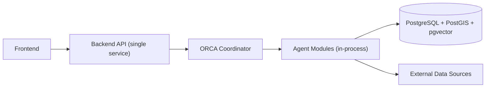
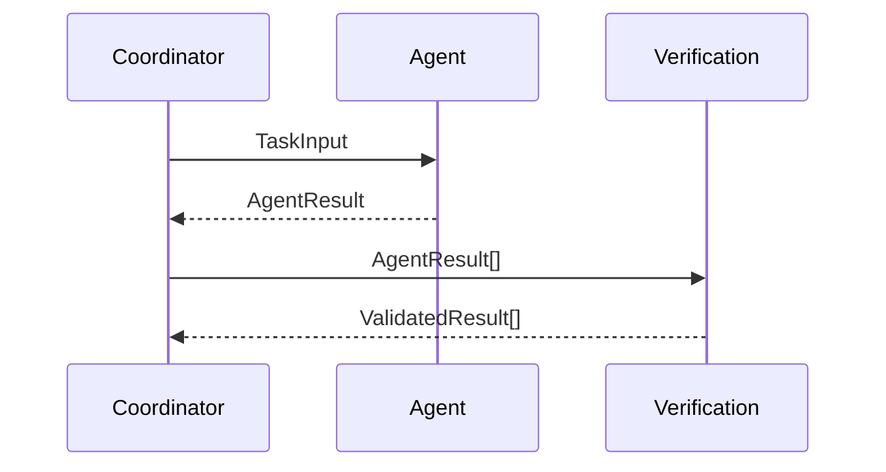
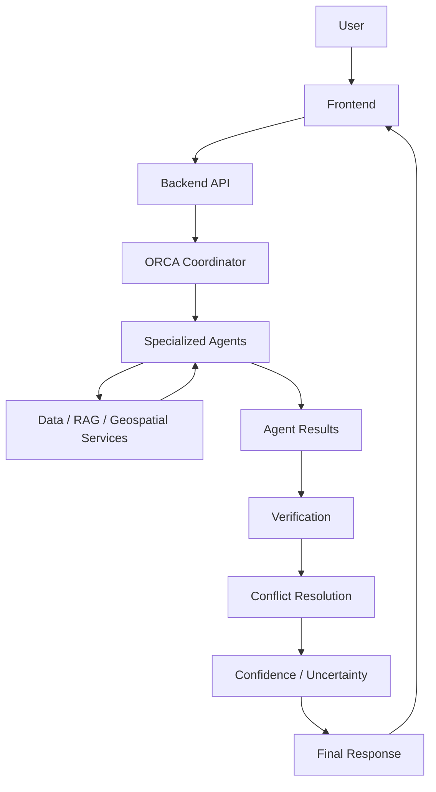

# ARCHITECTURE_RULES.md

# ORCA — Marine Ecosystems Reasoning with Collaborative Agents
## Technical Architecture Governance Rules

**SIH Problem ID:** SIH26176
**Audience:** AI coding agents (Google Antigravity IDE, OpenCode) and human contributors
**Source of Truth:** `PROJECT_MASTER.md`, `PROBLEM_STATEMENT.md`, `PRD.md`, `SYSTEM_ARCHITECTURE.md`, `CORE_INNOVATION_ARCHITECTURE.md`, `AGENT_ARCHITECTURE.md`, `DATABASE_SCHEMA.md`
**Document Status:** Governance — binding on all code generation and modification
**Version:** 1.0
**Last Updated:** 30 August 2026

---

## 0. How This Document Works

- Every rule below is derived from the ORCA project documentation listed above. Nothing here introduces a requirement that conflicts with that documentation.
- Where the source documentation does not specify a decision, this document says so explicitly: **`TBD – Requires Architecture Decision`**. An AI coding agent must not silently resolve a `TBD` by inventing an architecture decision — it must surface the gap.
- This is a **rules document**, not a design narrative. It is written to be checked against, not just read.
- MVP feasibility governs every rule: this project is a **student-built, 60–70% working prototype**, not a production system. Rules are written to prevent chaos, not to demand enterprise infrastructure the team cannot build in the available time.

---

## 1. Architectural Principles

| # | Principle | Source |
|---|---|---|
| P1 | Evidence before explanation — no conclusion without retrieved evidence | `PROJECT_MASTER.md §24 P1` |
| P2 | Observation ≠ Interpretation — keep observed, derived, inferred, and recommended clearly distinct | `PROJECT_MASTER.md §24 P2` |
| P3 | Correlation ≠ Causation — never state or imply causation without qualification | `PROJECT_MASTER.md §24 P3`, PRD FR-008 |
| P4 | Traceability — every important conclusion must be traceable to evidence | `PROJECT_MASTER.md §24 P4`, PRD FR-011 |
| P5 | Uncertainty is a feature — insufficient evidence must be stated, not hidden | `PROJECT_MASTER.md §24 P5`, PRD FR-013 |
| P6 | Human oversight — ORCA provides decision support, never autonomous authority | `PROJECT_MASTER.md §24 P6` |
| P7 | Modular architecture — agents/services replaceable without redesigning the whole system | `PROJECT_MASTER.md §24 P7` |
| P8 | Implementation independence — the conceptual architecture holds regardless of language, framework, database, or model provider | `PROJECT_MASTER.md §24 P8` |
| P9 | Smallest system that convincingly demonstrates the reasoning loop — no feature added without a traced requirement | `PROJECT_MASTER.md §20.5`, `§23.2` |

Any generated code that violates a principle above is a defect, even if it "works."

---

## 2. System Architecture

**Pattern: modular monolith.** One deployable backend service containing an internally modular agent layer, plus a separate frontend. **Not** a microservices architecture, **not** Kubernetes, **not** a distributed system — this is explicitly rejected at prototype scale (`SYSTEM_ARCHITECTURE.md §3, §23`).

**Rule SA-1:** An AI coding agent must not introduce a new deployable service, container, or process boundary unless this document is updated first to justify it. Splitting an agent module into its own service is a production-evolution item (`SYSTEM_ARCHITECTURE.md §24`), not a default.

**Rule SA-2:** No message queue, event bus, or pub/sub system may be introduced for agent-to-agent communication. Communication is in-process, typed function calls only (`AGENT_ARCHITECTURE.md §12`).

---

## 3. Frontend Architecture

**Rule FE-1: The frontend must not perform scientific reasoning.** No confidence calculation, no anomaly detection, no relationship classification, no causal-language filtering, no evidence validation may be implemented in frontend code. The frontend renders what the backend already validated and synthesized (`PRD.md FR-014`, `SYSTEM_ARCHITECTURE.md §15`).

**Rule FE-2: The frontend must not directly access the database.** All data flows through the Backend API. No direct PostgreSQL/PostGIS/pgvector connection from frontend code, ever.

**Rule FE-3: The frontend must not call external marine data sources directly.** All source access goes through backend adapters (`SYSTEM_ARCHITECTURE.md §7`) so every retrieval is cataloged and logged.

**Rule FE-4: The frontend must not embed API keys, model credentials, or data-source credentials.** These live only in backend configuration (§21).

**Rule FE-5: The frontend renders three coordinated panels** — conversational, map, evidence (`SYSTEM_ARCHITECTURE.md §15`). No panel duplicates another panel's data-fetching logic; all three consume the same backend response object.

**Framework:** Next.js/React, per `PROJECT_MASTER.md §15.1` (proposed, not locked — P8).
**Exact component library / state management approach:** `TBD – Requires Architecture Decision`.

---

## 4. Backend Architecture

**Rule BE-1:** The backend is a single deployable service (§2). Internally it is organized into clearly separated modules — API layer, Orchestrator (Coordinator), Agent modules, Evidence store, Validation module, Synthesis module (`SYSTEM_ARCHITECTURE.md §3`).

**Rule BE-2:** Business/scientific logic (unit normalization, spatial filtering, confidence calculation, causal-language checks) lives in backend modules, never in API route handlers directly. Route handlers parse requests, call the Coordinator, and serialize responses — nothing else.

**Rule BE-3:** The backend must expose a status/progress channel so the frontend can display orchestration progress (`PROJECT_MASTER.md §19.4`), not just a single blocking request/response.

**Language/framework:** Python-based, consistent with `PROJECT_MASTER.md §15.2, §15.5` (Pandas/NumPy/Xarray/geospatial libraries). Exact web framework: `TBD – Requires Architecture Decision`.

---

## 5. Agent Architecture

Eight agents, each a bounded module, not a separate service (`AGENT_ARCHITECTURE.md`):

1. Ocean Agent
2. Ecosystem Agent
3. Fisheries Agent
4. Safety Agent
5. Geospatial Agent
6. Knowledge/RAG Agent
7. Verification Agent
8. ORCA Coordinator

**Rule AA-1:** No agent may be added to this list without updating `AGENT_ARCHITECTURE.md §16`'s justification analysis first. An AI coding agent must not invent a ninth agent (e.g., a "Climate Agent") to satisfy a feature request unless that agent is added to the approved documentation.

**Rule AA-2:** Every agent's output must conform to the shared `AgentResult` schema: `{claim, evidence[], confidence_input, data_labels[], spatial_scope, temporal_scope}` (`AGENT_ARCHITECTURE.md §12`). No agent may return an ad hoc shape.

Full per-agent boundaries are defined in Section 15 below.

---

## 6. Data Architecture

**Rule DA-1:** All marine data is one of four labeled types: `observation`, `forecast`, `nowcast`, `advisory` (PRD FR-007). No code path may merge these into a single unlabeled value.

**Rule DA-2:** All data originates from a cataloged source registered in `data_sources` (PRD FR-005, `DATABASE_SCHEMA.md §2`). An AI coding agent must not add a data retrieval call to an uncataloged source/endpoint.

**Rule DA-3:** Numeric marine values and unstructured reference text are stored and retrieved through separate paths — structured tables (`observations`, `pfz_advisories`, `hazard_alerts`) vs. `knowledge_chunks` (vector store). These paths must never be conflated (`CORE_INNOVATION_ARCHITECTURE.md §3`, `AGENT_ARCHITECTURE.md §6`).

**Rule DA-4:** Evidence provenance (`Source → Dataset → Query → Transformation → Analysis → Result`, `PROJECT_MASTER.md §14.4`) must be preserved end-to-end through every transformation step — no intermediate step may drop the link back to source.

---

## 7. RAG Architecture

**Rule RAG-1:** RAG is scoped to exactly one purpose: retrieving curated scientific/domain reference text to support an agent's explanation. It is never used to retrieve or infer a numeric marine observation, forecast, or threshold value (`SYSTEM_ARCHITECTURE.md §12`, `AGENT_ARCHITECTURE.md §6`).

**Rule RAG-2:** The corpus is small, curated, and versioned (`knowledge_documents`). No open web crawling or unbounded ingestion into the vector store is permitted (`PROJECT_MASTER.md §14.1`).

**Rule RAG-3:** Every retrieved passage used in a response must carry citation metadata (`document_id`, `title`, `version`) and must be paraphrased, not reproduced at length, in user-facing text.

**Rule RAG-4:** RAG retrieval and structured data retrieval are handled by different agents (Knowledge/RAG Agent vs. Ocean/Ecosystem/Fisheries/Safety Agents). No agent may implement both retrieval mechanisms internally — this violates the separation established in `AGENT_ARCHITECTURE.md §6`.

**Embedding model / provider:** `TBD – Requires Architecture Decision` (provider-agnostic per P8; dimension configurable, `DATABASE_SCHEMA.md §8`).

---

## 8. Knowledge Architecture

**Rule KA-1:** ORCA does **not** implement a persistent knowledge graph in the prototype. This was explicitly evaluated and rejected as premature relative to approved requirements (`SYSTEM_ARCHITECTURE.md §11`).

**Rule KA-2:** The "explainable reasoning graph" referenced in project documentation (`CORE_INNOVATION_ARCHITECTURE.md §10`) is a **per-query, log-derived reconstruction** (from `agent_runs`, `agent_outputs`, `evidence`), not a standing graph database. An AI coding agent must not introduce a graph database (Neo4j or similar) to satisfy this requirement — the structured relational tables already satisfy it.

**Rule KA-3:** If a future task explicitly requires cross-query, cumulative domain knowledge (entity relationships persisting across queries), this is a scope change requiring a documented architecture decision, not an incidental addition.

---

## 9. Geospatial Architecture

**Rule GEO-1:** All spatial storage uses PostGIS `GEOGRAPHY` types (not `GEOMETRY`) for correct real-world distance calculation (`DATABASE_SCHEMA.md §17`).

**Rule GEO-2:** All spatial filtering uses a per-source documented tolerance radius (`data_sources.spatial_tolerance_m`), never a single global default (`AGENT_ARCHITECTURE.md §5`).

**Rule GEO-3:** Location resolution (place name/coordinates → canonical geometry) is owned exclusively by the Geospatial Agent. No other agent may implement its own geocoding or gazetteer lookup.

**Rule GEO-4:** The Geospatial Agent does not perform route planning or navigation advisory — that is explicitly `[FUTURE]` and out of current scope (`AGENT_ARCHITECTURE.md §5` Forbidden Responsibilities, `PRD.md §11`).

---

## 10. Verification Architecture

**Rule VER-1:** The Verification Agent is a **mandatory, non-bypassable gate**. No code path may allow an `AgentResult` to reach Synthesis without first passing through Verification (`AGENT_ARCHITECTURE.md §7, §14`).

**Rule VER-2:** Verification checks are deterministic, rule-based checks — not a second LLM "opinion" call used as the sole gate. This keeps the gate auditable and reproducible (PRD NFR-003).

**Rule VER-3:** A claim that fails evidence-completeness is blocked outright, not passed through with a warning label. A claim that fails the causal-language check may be rewritten and re-checked up to a bounded retry count, then blocked if still failing (`AGENT_ARCHITECTURE.md §7`).

**Rule VER-4:** Conflict detection and resolution are owned exclusively by the Verification Agent. No domain agent may resolve a conflict itself.

---

## 11. API Architecture

**Rule API-1:** The Backend API exposes, at minimum: a query-submission endpoint and a status/progress endpoint (§4). Exact route naming/versioning scheme: `TBD – Requires Architecture Decision`.

**Rule API-2:** The API is the **only** boundary the frontend crosses. Every frontend data need is satisfied by an API response — never by the frontend independently deriving or fetching data.

**Rule API-3:** API responses that include an analytical conclusion must conform to the output contract (`question, observations, analysis, evidence, confidence, uncertainty, implications, recommended_next_step` — PRD FR-014). No endpoint may return a conclusion without these fields (marking "not applicable" where empty is valid; omitting the field is not).

**Rule API-4:** The API must not expose raw database rows, internal agent state, or LLM prompts directly to the frontend — only the assembled, validated response object and its evidence references.

---

## 12. Database Architecture

Full schema is defined in `DATABASE_SCHEMA.md` — this section states the governing rules an AI coding agent must follow when touching the schema.

**Rule DB-1:** One generalized `observations` table with a `variable_type` discriminator, not one table per variable (SST/waves/currents/chlorophyll/tide). Do not create `sst_readings`, `wave_readings`, etc. as separate tables (`DATABASE_SCHEMA.md §0`).

**Rule DB-2:** `pfz_advisories` and `hazard_alerts` remain separate tables from `observations` — they are derived/attributed products, not raw measurements. Do not merge them into `observations`.

**Rule DB-3:** No `users` table. Session-scoped context only, via `conversation_sessions`, with no personal data (`DATABASE_SCHEMA.md §9`, `SYSTEM_ARCHITECTURE.md §21`).

**Rule DB-4:** `hazard_alerts.source_id` and `source_reference` are `NOT NULL` by design — this enforces FR-016/FR-017 at the schema level. Do not relax this constraint to make ingestion "easier."

**Rule DB-5:** `evidence` rows must reference exactly one of `observation_id` / `advisory_id` / `alert_id` / `chunk_id` (the `num_nonnulls = 1` constraint). Do not add a code path that inserts an evidence row with zero or multiple references.

**Rule DB-6:** No schema change may remove or weaken a constraint listed in `DATABASE_SCHEMA.md §22` without an explicit architecture decision recorded in this document.

---

## 13. Data Ingestion Architecture

**Rule ING-1:** Ingestion is **pull-based, on-demand per query** in the prototype — not a continuous streaming pipeline (`SYSTEM_ARCHITECTURE.md §7`). Do not build a scheduler/streaming ingestion service for the prototype.

**Rule ING-2:** Every source adapter is bound to exactly one `data_sources` catalog entry, with provider, access method, resolution, coverage, and limitations documented before the adapter is used (`PROJECT_MASTER.md §14.3`).

**Rule ING-3:** Ingested data is normalized (units, coordinate system) and labeled (`data_type`) before storage — never stored raw-and-unlabeled in a queryable table.

**Rule ING-4:** A short-TTL cache is used to avoid redundant calls to the same source/region/time within a session (`SYSTEM_ARCHITECTURE.md §7`), to protect the invocation/cost budget (NFR-008). Exact TTL value: `TBD – Requires Architecture Decision`.

---

## 14. Agent Communication

**Rule COMM-1:** All agent communication is Coordinator-mediated. **No agent calls another agent directly.** Every inter-agent data dependency is expressed in the Coordinator's task graph (`AGENT_ARCHITECTURE.md §9, §12`).

**Rule COMM-2:** Communication uses typed, in-process function calls (or `asyncio` for concurrent independent sub-tasks) — not HTTP calls between agent modules, not a queue.

**Rule COMM-3:** The only data contract between agents is the shared `AgentResult` schema (§5 above). Agents must not pass ad hoc dictionaries or untyped objects to each other.

---

## 15. ORCA Coordinator Responsibilities

Full specification: `AGENT_ARCHITECTURE.md §8`. Summary of binding rules:

**Rule COORD-1:** The Coordinator owns intent extraction, context merging, task planning, routing, dispatch, and final synthesis assembly. It does **not** originate marine claims itself.

**Rule COORD-2:** The Coordinator must never invoke an agent not required by the routing table for the given intent (protects NFR-008).

**Rule COORD-3:** The Coordinator must never bypass the Verification Agent, even under latency pressure. A bounded-timeout degraded response (marking the gap explicitly) is the correct mechanism, not skipping validation.

**Rule COORD-4: Multi-domain questions must go through the Coordinator's task graph** — a question requiring Ocean + Safety + Fisheries data is never handled by one agent improvising calls to the others; it is decomposed and routed centrally.

---

## 16. Agent Responsibility Boundaries

Full detail: `AGENT_ARCHITECTURE.md §1–§8`. This section is the enforceable summary for code review / AI-agent self-check.

### Ocean Agent
- **Responsibility:** Retrieve/normalize physical oceanographic variables (SST, waves, currents, tides).
- **Allowed inputs:** `{location, time_window, requested_variables[]}` from Coordinator.
- **Allowed outputs:** `AgentResult` with labeled, sourced physical variable values.
- **Data access:** `observations` table (via catalog-registered adapters), oceanographic sources only.
- **Tools:** Source adapters, PostGIS filter, Pandas/NumPy for normalization/baseline comparison.
- **Dependencies:** Geospatial Agent (location), data source catalog.
- **Forbidden:** Fishing-safety judgments, hazard warnings, ecological/biological interpretation.
- **Communication with Coordinator:** Receives task input, returns `AgentResult` only — no direct calls to other agents.
- **Failure behavior:** Source unreachable → `data_unavailable` status, never a fabricated value.

### Ecosystem Agent
- **Responsibility:** Reason over ecological/biological indicators and their alignment with physical variables (correlation only, never causal).
- **Allowed inputs:** `{location, time_window, requested_indicators[]}`; Ocean Agent output via Coordinator.
- **Allowed outputs:** `AgentResult` with `relationship_classification` and mandatory non-causal qualification text.
- **Data access:** Ecological indicator sources; historical baseline data.
- **Tools:** Temporal/spatial alignment comparator.
- **Dependencies:** Ocean Agent (via Coordinator), Verification Agent (causal-language check).
- **Forbidden:** Causal claims; fishing-zone or safety recommendations.
- **Communication with Coordinator:** Same pattern as Ocean Agent.
- **Failure behavior:** Insufficient baseline data → `insufficient_evidence` status.

### Fisheries Agent
- **Responsibility:** Answer fishing-zone/condition questions by combining Ocean + Ecosystem outputs with official PFZ-type advisories where cataloged.
- **Allowed inputs:** `{location, time_window, query_type}`; Ocean and Ecosystem Agent outputs via Coordinator.
- **Allowed outputs:** `AgentResult` citing contributing variables and/or an official advisory reference.
- **Data access:** `pfz_advisories` table; Ocean/Ecosystem outputs (never independently re-retrieves their raw data).
- **Tools:** Documented combination-rule function (sourced from authoritative fisheries guidance, not invented).
- **Dependencies:** Ocean Agent, Ecosystem Agent, official PFZ catalog entry.
- **Forbidden:** Hazard/safety judgments; fabricating a PFZ boundary not backed by an official source or documented rule.
- **Communication with Coordinator:** Runs strictly after Ocean/Ecosystem complete (sequential dependency in task graph).
- **Failure behavior:** No advisory + low combination-rule confidence → `insufficient_evidence`, never a synthesized guess.

### Safety Agent
- **Responsibility:** Aggregate and report active hazard alerts and restrictions, strictly attributed to authoritative sources.
- **Allowed inputs:** `{location, time_window, query_type: "hazard_check"}`.
- **Allowed outputs:** `AgentResult` with `alerts[]`, `source_attribution[]`, `validity_window[]`.
- **Data access:** `hazard_alerts` table only.
- **Tools:** Source adapters for hazard feeds; geofencing lookup.
- **Dependencies:** Data source catalog; Verification Agent (zero-fabrication check).
- **Forbidden — absolute:** Must never generate, predict, or infer a hazard not present in an authoritative source. Must never issue a "safe to go" verdict.
- **Communication with Coordinator:** Runs independently (parallel-eligible); never delegates hazard judgment elsewhere.
- **Failure behavior:** Feed unreachable → explicit `data_unavailable`, must **not** be interpreted as "no alert."

### Geospatial Agent
- **Responsibility:** Resolve locations, apply spatial filtering with documented tolerance, produce map-renderable geometry.
- **Allowed inputs:** Location string/coordinates from intent extraction; per-source tolerance from catalog.
- **Allowed outputs:** Canonical geometry, GeoJSON, filtered-observation references.
- **Data access:** `locations` table; coastal/maritime reference data.
- **Tools:** PostGIS functions; gazetteer lookup.
- **Dependencies:** Used by every other agent — a shared service beneath them, not a peer.
- **Forbidden:** Marine variable interpretation; analytical claims; full route/navigation advisory.
- **Communication with Coordinator:** Typically resolves location first in the task graph (sequential precondition for domain agents).
- **Failure behavior:** Cannot resolve location → `location_unresolved`; Coordinator requests clarification, never guesses.

### Knowledge/RAG Agent
- **Responsibility:** Retrieve curated scientific/domain reference text to support explanations.
- **Allowed inputs:** A contextual sub-query from another agent or the Coordinator.
- **Allowed outputs:** `passages[]` with citation metadata — text only, never numeric marine values.
- **Data access:** `knowledge_chunks` / `knowledge_documents` (pgvector) only.
- **Tools:** Embedding-based similarity search.
- **Dependencies:** Curated corpus maintenance (content-governance dependency).
- **Forbidden:** Supplying or implying any numeric marine observation, forecast, or threshold; retrieving from uncataloged/uncurated web sources.
- **Communication with Coordinator:** Invoked as a supporting sub-task, not a primary domain agent for numeric questions.
- **Failure behavior:** No relevant passage above threshold → `no_relevant_context`; pipeline proceeds without enrichment, not blocked.

### Verification Agent
- **Responsibility:** Mandatory gate — causal-language check, evidence completeness, conflict detection, data-quality flagging.
- **Allowed inputs:** All `AgentResult` objects for the current query.
- **Allowed outputs:** `ValidatedResult` per claim; `conflicts[]` records.
- **Data access:** Reads other agents' outputs and catalog quality metadata; writes to `conflicts` table.
- **Tools:** Deterministic rule checks (causal-language lint, evidence-completeness checker, conflict comparator).
- **Dependencies:** Every domain agent (runs after all of them).
- **Forbidden:** Originating new marine claims; silently resolving conflicts.
- **Communication with Coordinator:** Sits as a mandatory pass-through stage between agent dispatch and synthesis.
- **Failure behavior:** Retry limit exceeded → claim blocked, uncertainty statement generated instead.

### ORCA Coordinator
- **Responsibility:** Own the full query lifecycle — intent, context, planning, routing, dispatch, synthesis assembly, logging.
- **Allowed inputs:** Raw user query; prior conversation context.
- **Allowed outputs:** Final output-contract response; orchestration log entries.
- **Data access:** `conversation_sessions`, `queries`, `agent_runs`, `orchestration_logs`.
- **Tools:** Intent-extraction LLM call (bounded), rule-based routing table.
- **Dependencies:** All seven other agents; Verification Agent (mandatory pass-through).
- **Forbidden:** Originating domain claims itself; skipping validation under latency pressure.
- **Communication with Coordinator:** N/A — this *is* the Coordinator.
- **Failure behavior:** Intent unresolved → clarifying question; agent failure → assemble from available validated evidence, marking the gap explicitly.

---

## 17. Dependency Rules

**Rule DEP-1:** Dependency direction is one-way: `Frontend → API → Coordinator → Agents → Data/RAG/Geospatial services`. No layer calls "upward."

**Rule DEP-2:** Domain agents (Ocean, Ecosystem, Fisheries, Safety) may depend on the Geospatial Agent and, via the Coordinator, on each other's outputs when the task graph specifies a sequential dependency (`AGENT_ARCHITECTURE.md §11`). They must not depend on the Knowledge/RAG Agent for numeric data — only for optional explanatory context.

**Rule DEP-3:** The Verification Agent depends on domain agents' outputs; no domain agent may depend on the Verification Agent's internals (only on its pass/fail result, delivered via the Coordinator).

**Rule DEP-4:** No circular dependency between agents is permitted. The task graph must be a DAG (directed acyclic graph); an AI coding agent must reject/flag any task-graph construction that would create a cycle.

---

## 18. Error Handling Architecture

**Rule ERR-1:** Every failure path produces a truthful, bounded response — never a silent wrong answer, never an unbounded retry loop (`SYSTEM_ARCHITECTURE.md §22`).

| Failure | Required behavior |
|---|---|
| External source unreachable | Explicit "data unavailable" in response; no fabricated value (NFR-004) |
| Conflicting source values | Surfaced explicitly, never silently resolved (FR-010) |
| Claim without evidence | Blocked at Verification, never reaches synthesis (FR-011) |
| LLM causal language | Caught by deterministic post-filter; rewritten and re-checked, or blocked |
| Insufficient evidence | Uncertainty statement generated, not a forced conclusion (FR-013) |
| Validation retry limit exceeded | Response returned with an explicit "unable to fully validate" note |
| Agent timeout | Coordinator assembles from available validated evidence, marking the gap |

**Rule ERR-2:** No `except: pass` or silent swallow of an error that affects a returned marine claim. Every caught exception on the reasoning path must either produce a user-visible uncertainty note or a logged, non-silent failure state.

---

## 19. Observability

**Rule OBS-1:** Every orchestration run must produce a retrievable log capturing: agents invoked, sources queried, validation steps executed, timing (NFR-005). This is satisfied structurally by `agent_runs` + `agent_outputs` (`DATABASE_SCHEMA.md §11–§12`) — an AI coding agent must populate these tables on every run, not just on success.

**Rule OBS-2:** No full observability stack (distributed tracing, dashboards, alerting infrastructure) is required or expected for the prototype (`SYSTEM_ARCHITECTURE.md §20`). Structured logs plus the tables above are sufficient. Do not add tracing/APM tooling unless explicitly requested.

**Rule OBS-3:** Latency per query stage and agent-invocation count must be measurable (to evaluate NFR-001 and NFR-008) — at minimum via timestamps already present in `agent_runs`.

---

## 20. Security Boundaries

**Rule SEC-1: Secrets must never be hardcoded.** All API keys, data-source credentials, and model provider credentials are loaded from environment configuration / a secrets mechanism, never committed to source (§21).

**Rule SEC-2:** Input from the user (query text) must be validated/sanitized before reaching the LLM layer and before any downstream database query, to prevent injection (`SYSTEM_ARCHITECTURE.md §21`).

**Rule SEC-3:** No user authentication/account system is required or permitted for the prototype scope — session state is an opaque, non-PII token only (`SYSTEM_ARCHITECTURE.md §21`, `DATABASE_SCHEMA.md §9`). Do not add login, password storage, or user profile tables.

**Rule SEC-4:** Backend service credentials are scoped to only the data source catalog and datastore they need (least privilege) — no broad "admin" credential used for routine operations.

**Rule SEC-5: Hazard/alert attribution integrity is a security-adjacent rule, not just a data rule** — `hazard_alerts.source_id`/`source_reference` must remain `NOT NULL` in all environments, including test/dev, to prevent any code path from generating an unattributed hazard claim (FR-017).

---

## 21. Configuration Management

**Rule CFG-1:** All environment-specific values (API endpoints, credentials, tolerance defaults, TTLs, model provider selection) live in configuration, not code.

**Rule CFG-2:** Configuration is layered: base defaults (safe for all environments) + environment overrides (dev/staging/prod) — exact mechanism (`.env` files, a config service, etc.): `TBD – Requires Architecture Decision`.

**Rule CFG-3:** The data source catalog (`data_sources` table) is treated as configuration-adjacent data, not code — adding a new source is a data operation (catalog entry + adapter registration), never a hardcoded branch in agent logic.

**Model/provider selection:** `TBD – Requires Architecture Decision` (`PROJECT_MASTER.md §15.3` Q10, still open).

---

## 22. Testing Boundaries

**Rule TEST-1:** Each FR/NFR in `PRD.md` has a stated acceptance criterion — tests should target those criteria directly (e.g., an automated evidence-audit script for NFR-002, a causal-language lint test for NFR-006), not vague "smoke tests."

**Rule TEST-2:** Agent-level tests must use the shared `AgentResult` schema as the test fixture shape — no agent-specific ad hoc test format.

**Rule TEST-3:** Verification Agent checks (causal-language, evidence completeness, conflict detection) must be tested with seeded data specifically designed to trigger each failure mode (per `SYSTEM_ARCHITECTURE.md §22` failure table) — not only with "happy path" data.

**Rule TEST-4:** Frontend tests must not assert on backend reasoning correctness (e.g., "is this confidence label right") — that belongs to backend/agent tests. Frontend tests assert rendering of a given backend response, consistent with Rule FE-1's separation.

**Rule TEST-5:** No test may bypass the Verification Agent to "simplify" testing an agent in isolation without also having a separate end-to-end test that includes Verification — an agent must never be shown to work only in a configuration that skips the mandatory gate.

---

## 23. Deployment Architecture

**Rule DEPLOY-1:** The prototype deploys as **one backend service + one frontend app + one PostgreSQL/PostGIS/pgvector instance.** No Kubernetes, no container orchestration platform, no distributed infrastructure unless a specific, documented requirement forces it (none currently does).

**Rule DEPLOY-2:** Containerization (a single Dockerfile per service) is acceptable and reasonable for reproducibility, but this is packaging, not architecture — it must not be used to justify splitting the backend into multiple services.

**Exact hosting/CI-CD platform:** `TBD – Requires Architecture Decision` (`PROJECT_MASTER.md §15.7` leaves this open deliberately).

---

## 24. MVP Architecture Constraints

Binding restatement of `PRD.md §9` and `SYSTEM_ARCHITECTURE.md §23`:

- Single controlled demonstration region and time window.
- Small, documented dataset catalog — not the full production data ecosystem.
- FR-001, FR-002, FR-004–FR-009, FR-011–FR-015 must work end-to-end; FR-003 (regional language), FR-010 (conflict surfacing), FR-016/FR-017 (hazard alerts), FR-018 (data-quality flags) are **Prototype-tier**, not MVP-tier — do not block MVP delivery on them (`PRD.md §9–§10`).
- No knowledge graph, no microservices, no multi-tenant auth, no streaming ingestion — all explicitly excluded (`SYSTEM_ARCHITECTURE.md §23`).
- Reasoning quality and evidence traceability take priority over agent count or feature breadth (`PROJECT_MASTER.md §9.4`).

**Rule MVP-1:** An AI coding agent must not "gold-plate" the MVP by implementing Future-tier items (What-If reasoning, user personalization, route intelligence, additional agents) before the MVP-tier and Prototype-tier requirements are complete and passing their acceptance criteria.

---

## 25. Future Production Architecture

Restated from `SYSTEM_ARCHITECTURE.md §24` — direction only, not current build scope:

| Prototype element | Possible evolution | Gated on |
|---|---|---|
| In-process agent modules | Independently scaled services | Demonstrated per-agent throughput bottleneck |
| Pull-based ingestion | Scheduled/streaming ingestion, data lake | Approved real-time freshness requirement |
| pgvector on shared instance | Dedicated vector database service | Corpus/query volume growth |
| No knowledge graph | Scientific knowledge graph | Approved causal/cross-domain reasoning requirement |
| Minimal structured logging | Full observability stack | Operational deployment |
| No auth system | Institutional auth/RBAC | Operational integration (requires institutional authorization) |
| Single-region dataset | Multi-region coverage | Validated data availability (A1/A2 still Pending) |

**Rule FUTURE-1:** No item in this table may be implemented in the current codebase without first updating this document to move it out of "Future" status with an explicit rationale.

---

## DATA FLOW RULES

1. This exact sequence is mandatory. No step may be skipped, reordered, or short-circuited.
2. Data enters the reasoning path **only** through a cataloged adapter (DA-2, ING-2) — never through an ad hoc fetch inside a UI component or a route handler.
3. Every arrow in the diagram corresponds to a typed object (`Query`, `TaskGraph`, `AgentResult[]`, `ValidatedResult[]`, `Recommendation`) — untyped dict-passing between these stages is not permitted.
4. The Frontend receives only the `Recommendation` object (plus supporting evidence/map payloads) — never raw agent internals.

---

## AGENT ORCHESTRATION RULES

1. **Multi-domain questions must go through the Coordinator.** No agent decomposes a task and calls other agents on its own initiative.
2. **Agents must not randomly call unrelated agents.** Every inter-agent dependency must be declared in the task graph, matching the Dependency Rules (§17) and the specific dependencies listed per agent (§16).
3. Independent sub-tasks are dispatched in parallel; dependent sub-tasks are dispatched sequentially per the task graph (`AGENT_ARCHITECTURE.md §10–§11) — this choice is made by the Coordinator's routing logic, not by an agent deciding to wait on another agent itself.
4. Only agents required by the routing table for the given intent are invoked — invoking the full agent roster "just in case" violates Rule COORD-2 and NFR-008.
5. Every agent invocation is logged in `agent_runs` before the agent begins work, and updated on completion/failure — no invocation may go unlogged.

---

## API CONTRACT RULES

1. Every endpoint returning an analytical response conforms to the output contract (API-3).
2. Endpoints are versioned/named such that a breaking change to the response shape is never silently deployed against an existing frontend build — exact versioning scheme: `TBD – Requires Architecture Decision`.
3. No endpoint may accept a request that allows the frontend to specify which agents to invoke, which data sources to query, or to inject raw SQL/queries — the frontend supplies intent (a question), not execution instructions.
4. Error responses are structured and typed (matching Section 18's failure table), never a raw stack trace or unhandled exception surfaced to the client.

---

## DATABASE ACCESS RULES

1. Only backend code accesses the database. No direct frontend, no direct external-facing access.
2. Only the Coordinator/Agents/Verification/Synthesis modules write to reasoning-path tables (`agent_runs`, `agent_outputs`, `evidence`, `conflicts`, `recommendations`). Ingestion adapters write only to `observations`, `pfz_advisories`, `hazard_alerts`, `data_sources`.
3. All spatial queries use the tolerance-aware `ST_DWithin`/containment patterns defined in `DATABASE_SCHEMA.md §18` — no ad hoc bounding-box math outside PostGIS functions.
4. Schema changes follow Rule DB-6 — constraints are not weakened without a recorded decision.
5. No table listed in `DATABASE_SCHEMA.md §23` ("What Was Deliberately Left Out") may be added without updating this document and `DATABASE_SCHEMA.md` first.

---

## RAG RULES

(Restated for emphasis, consolidating §7 above)

1. RAG retrieves explanatory text only — never numeric marine data (RAG-1).
2. RAG corpus is curated and versioned, never an open crawl (RAG-2).
3. Every RAG-sourced passage in a response carries citation metadata and is paraphrased, not quoted at length (RAG-3).
4. RAG retrieval logic lives only in the Knowledge/RAG Agent (RAG-4) — no other agent implements its own embedding/similarity search.

---

## GEOSPATIAL PROCESSING RULES

(Restated for emphasis, consolidating §9 above)

1. `GEOGRAPHY` types only for spatial columns (GEO-1).
2. Per-source documented tolerance radius, never a hardcoded global default (GEO-2).
3. Location resolution is centralized in the Geospatial Agent (GEO-3).
4. No route-planning/navigation logic in the prototype (GEO-4).

---

## VERIFICATION RULES

(Restated for emphasis, consolidating §10 above)

1. Verification is mandatory and non-bypassable for every query (VER-1).
2. Checks are deterministic and rule-based, not solely an LLM self-assessment (VER-2).
3. Failed evidence-completeness = hard block; failed causal-language = bounded rewrite-and-recheck, then block (VER-3).
4. Conflict detection/resolution is exclusively Verification's responsibility (VER-4).
5. **LLM output must not automatically be treated as factual data.** Every LLM-generated claim must pass through Verification before it can appear in a response — an LLM call producing a plausible-sounding value does not bypass evidence/validation requirements.
6. **External data must pass validation before reasoning.** Data-quality flags (FR-018) must be evaluated before an agent uses a retrieved value in its reasoning, not only checked after the fact.

---

## SECURITY RULES

(Restated for emphasis, consolidating §20 above)

1. No hardcoded secrets, anywhere, in any environment (SEC-1).
2. Input sanitization before LLM and before database queries (SEC-2).
3. No user auth/account system; session state only, non-PII (SEC-3).
4. Least-privilege service credentials (SEC-4).
5. Hazard attribution fields remain `NOT NULL` in every environment (SEC-5).

---

## TESTING RULES

(Restated for emphasis, consolidating §22 above)

1. Tests target PRD acceptance criteria directly (TEST-1).
2. Agent tests use the shared `AgentResult` schema (TEST-2).
3. Verification tests include seeded failure-mode data, not only happy-path data (TEST-3).
4. Frontend tests assert rendering only, never backend reasoning correctness (TEST-4).
5. No agent test configuration may bypass Verification without a paired end-to-end test that includes it (TEST-5).

---

## MVP SIMPLIFICATION RULES

1. One backend service, one frontend, one database instance — no exceptions without updating this document (SA-1, DEPLOY-1).
2. One `observations` table, not one per variable (DB-1).
3. No knowledge graph (KA-1).
4. No message queue / event bus (SA-2).
5. No user accounts (SEC-3, DB-3).
6. No streaming ingestion — pull-based, on-demand only (ING-1).
7. No full observability stack — structured logs and the existing `agent_runs`/`agent_outputs` tables are sufficient (OBS-2).
8. No Kubernetes/container orchestration (DEPLOY-1).
9. Future-tier capabilities (What-If reasoning, user personalization, route intelligence, additional agents beyond the eight defined here) are not built before MVP/Prototype-tier requirements pass (MVP-1).
10. When a requirement is ambiguous or unspecified, mark it `TBD – Requires Architecture Decision` and stop — do not invent a resolution that expands scope.

---

## AI AGENT ARCHITECTURE DIRECTIVE

**This directive is binding on Google Antigravity IDE, OpenCode, and any other AI coding agent operating on the ORCA codebase.**

1. **Read this file before creating or modifying any architecture.** Before generating a new module, service, table, endpoint, agent, or cross-component data flow, the AI coding agent must first consult `ARCHITECTURE_RULES.md` in full.

2. **Do not violate a rule in this document without explicitly identifying the conflict.** If a requested change appears to require violating a rule above (for example, adding a new agent, splitting the backend into multiple services, or bypassing Verification), the AI coding agent must:
   - State explicitly which rule the change would violate.
   - State why the change appears necessary.
   - Stop and request a human architecture decision rather than silently implementing the violation.

3. **Do not resolve a `TBD – Requires Architecture Decision` item by inventing a decision.** Where this document marks something TBD (e.g., exact web framework, hosting platform, embedding model, API versioning scheme), the AI coding agent may propose an option but must flag it as a proposal requiring sign-off, not implement it as settled architecture.

4. **Do not add agents, services, databases, or infrastructure components not listed in this document** without first updating this document, `SYSTEM_ARCHITECTURE.md`, and `AGENT_ARCHITECTURE.md` to reflect and justify the addition, per the same Source Classification discipline used throughout the ORCA project documentation (`PROJECT_MASTER.md §0`).

5. **Treat this document as living, not static.** When an approved architecture decision changes a rule here, the rule must be updated in the same change — code and governance must never silently diverge.

6. **When in doubt, choose the smaller, more boring architecture.** Per Principle P9 and the MVP Simplification Rules above, the correct default when a design choice is ambiguous is the option that adds the least new infrastructure, not the most technically interesting one.

---

*End of ARCHITECTURE_RULES.md*