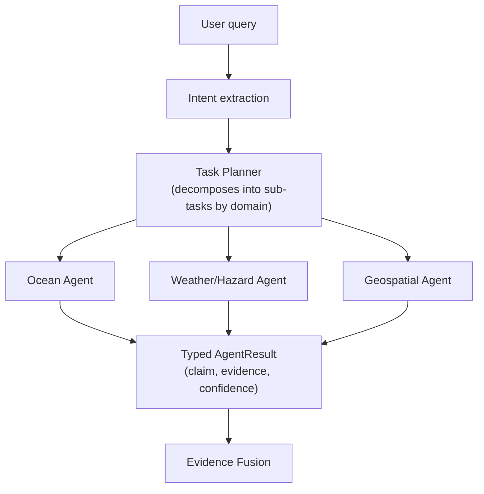
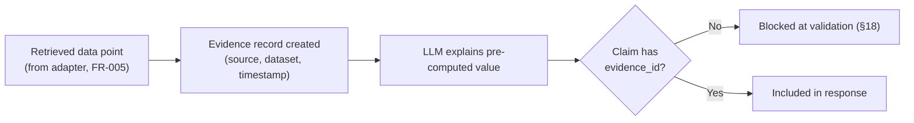
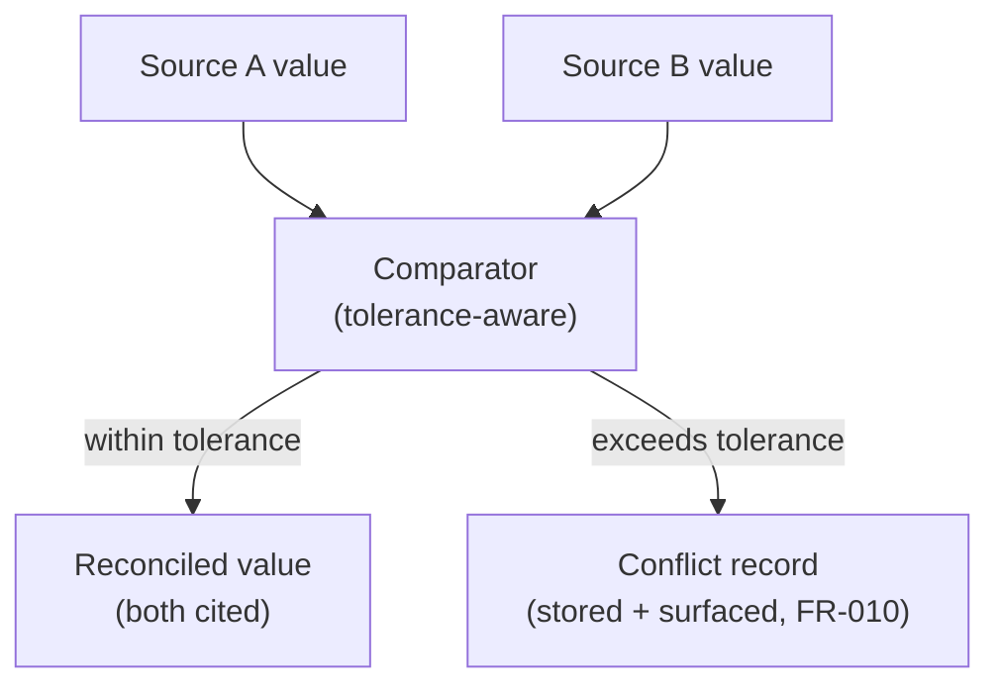
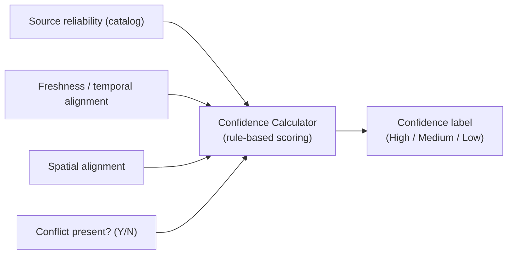
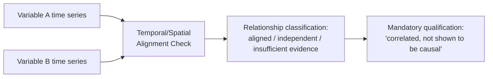
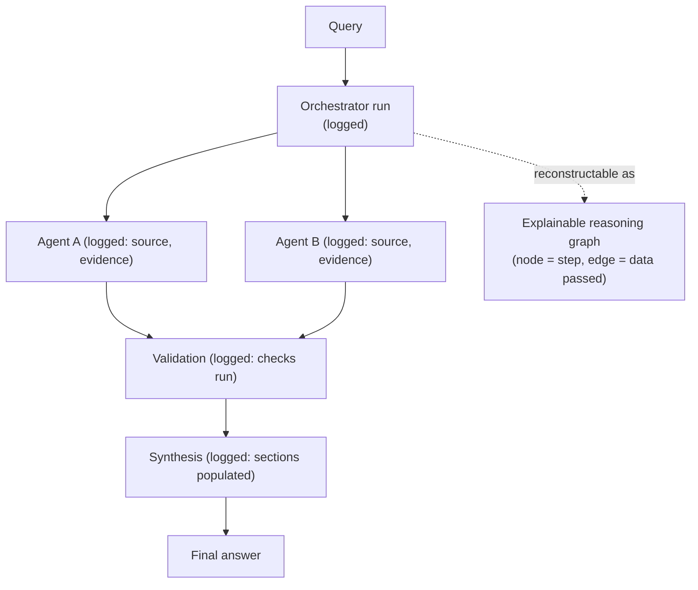

# CORE_INNOVATION_ARCHITECTURE.md

# ORCA — Marine Ecosystems Reasoning with Collaborative Agents
## Core Innovation Architecture

**SIH Problem ID:** SIH26176
**Document Status:** Draft — derived from approved PRD.md and SYSTEM_ARCHITECTURE.md
**Version:** 1.0
**Last Updated:** 30 August 2026

---

## 0. Purpose and Honesty Rule

This document exists to answer one question precisely:

> **What does ORCA actually do differently from (a) a conventional marine data dashboard, and (b) a generic LLM chatbot — at the technical, mechanical level, not the marketing level?**

Two ground rules govern every section below, carried over from `PROJECT_MASTER.md`'s Source Classification system and `PRD.md`'s testability requirement:

1. **No invented novelty.** Multi-agent orchestration, RAG, vector search, confidence scoring, and provenance tracking are all established techniques used elsewhere. ORCA's claim is never "we invented X." ORCA's claim is narrower: *this specific combination, applied to this specific problem, with these specific constraints, produces a system that neither a dashboard nor a plain chatbot produces.*
2. **Every section is tagged.** Per PRD §9–§11, some of the twelve topics requested here are prototype-feasible today; others (explicitly flagged) are `[FUTURE]` per `PROJECT_MASTER.md §23.3` and are **not** claimed as current ORCA capability. Presenting a future idea as a built differentiator would violate the project's own Critical Rule (`PROJECT_MASTER.md §0`). Each section states its status up front.

| # | Topic | Status |
|---|---|---|
| 1 | Multi-agent collaboration | 🟢 Prototype |
| 2 | Specialized domain agents | 🟢 Prototype |
| 3 | Evidence-grounded reasoning | 🟢 Prototype |
| 4 | Cross-source data fusion | 🟢 Prototype |
| 5 | Spatiotemporal reasoning | 🟢 Prototype |
| 6 | Agent conflict resolution | 🟢 Prototype (surfacing only — auto-resolution is limited) |
| 7 | Confidence estimation | 🟢 Prototype (deterministic, rule-based — not learned) |
| 8 | Uncertainty handling | 🟢 Prototype |
| 9 | Scientific relationship reasoning | 🟡 Partial — correlation-level only in prototype; causal-level is 🔵 Future |
| 10 | Explainable reasoning graph | 🟢 Prototype (log-derived, not a persisted knowledge graph — see §11 of SYSTEM_ARCHITECTURE.md) |
| 11 | What-if reasoning | 🔵 Future — not in approved PRD scope (PROJECT_MASTER.md §23.3) |
| 12 | User-specific decision support | 🔵 Future — no user-profile/personalization requirement in approved PRD |

Sections 11 and 12 are included below **as design direction only**, clearly separated from the ten prototype-feasible differentiators, so this document does not misrepresent future ideas as built capability.

---

## 1. Multi-Agent Collaboration

🟢 **Prototype**

### Problem
A single marine question (e.g., "is it safe to fish tomorrow morning?") requires evidence from several independent domains — sea state, weather, hazard alerts, tides — that no single specialist tool covers end-to-end (PRD UP-02).

### Existing Approach
A dashboard requires the *user* to be the integrator: open the weather layer, then the wave layer, then the alert feed, then mentally combine them (`PROBLEM_STATEMENT.md §10`). A generic chatbot, if given web/API access, typically makes retrieval calls and blends the results into one LLM pass with no separation of concerns — one model reasoning over everything at once, with no internal checks between domains.

### ORCA Approach
ORCA decomposes the question into a **task graph**, dispatches sub-tasks to domain-bounded agents (Section 2), and only combines their independently-produced, independently-evidenced findings at a dedicated fusion step (`SYSTEM_ARCHITECTURE.md §4`).

### Technical Mechanism

Each agent operates over a restricted tool/data scope (FR-004) and returns a structured, independently-auditable result — not free text blended mid-reasoning.

### Expected Benefit
Failures are localized and inspectable: if the wave estimate is wrong, that is traceable to one agent's output, not buried inside one long undifferentiated LLM response.

### Limitation
Decomposition adds orchestration overhead (extra calls, latency) compared to one monolithic LLM call — mitigated by NFR-008's invocation budget, but not free.

### Validation Method
Compare, on a benchmark query set: (a) evidence-traceability rate (NFR-002) and (b) causal-language violation rate (NFR-006) between the multi-agent pipeline and a single-pass LLM baseline over identical inputs.

---

## 2. Specialized Domain Agents

🟢 **Prototype**

### Problem
Marine variables differ in meaning, units, reliability, and interpretation rules — treating them uniformly risks category errors (e.g., interpreting a forecast as an observation).

### Existing Approach
A dashboard displays each domain's data through separately built layers/products (INCOIS's own service separation — ecosystem, hazard, forecast/nowcast, climate — per `PROBLEM_STATEMENT.md §4`), but nothing connects them programmatically. A chatbot with generic tool access treats every API response the same way — as text to summarize.

### ORCA Approach
Each agent (`SYSTEM_ARCHITECTURE.md §4`) is scoped to one data domain (ocean/marine, weather/hazard, geospatial, ecosystem, data quality — PROJECT_MASTER.md §13) with its own retrieval logic, unit handling, and labeling rules (FR-007).

### Technical Mechanism
An agent is a bounded module: `{allowed_sources, unit_normalizer, label_rules, domain_prompt}`. The router (FR-004) only dispatches a query to an agent whose declared domain matches the required evidence category — a hazard-only question never invokes the ecosystem agent, keeping the invocation count minimal (NFR-008).

### Expected Benefit
Domain-specific correctness (e.g., correct unit conversion, correct observation/forecast distinction) is enforced structurally per agent, rather than relying on one generalized prompt to get every domain right at once.

### Limitation
Agent boundaries must be maintained as the dataset catalog grows; a variable that spans two domains (e.g., an ecosystem indicator derived from an oceanographic variable) requires explicit hand-off logic, not automatic resolution.

### Validation Method
For a benchmark set of single-domain queries, verify (via orchestration logs, NFR-005) that only the matching agent was invoked, and that returned data carries the correct `data_type` label (FR-007) on 100% of test cases.

---

## 3. Evidence-Grounded Reasoning

🟢 **Prototype**

### Problem
An LLM can produce a fluent, plausible-sounding marine claim with no real observation behind it (hallucination risk, `PROJECT_MASTER.md §22 R1`).

### Existing Approach
A dashboard shows raw data with no generated claims at all — no hallucination risk, but also no synthesis. A generic chatbot generates claims from its training data or a single retrieval pass, often without a structural requirement to cite what backs each specific sentence.

### ORCA Approach
Every claim in a response must carry at least one evidence reference before it can pass validation (FR-011); the LLM is only allowed to *narrate* evidence that was already retrieved by code, not to originate values itself (`SYSTEM_ARCHITECTURE.md §13`).

### Technical Mechanism

### Expected Benefit
Structurally prevents the most common chatbot failure mode — a confident, sourceless claim — rather than relying on prompting alone to avoid it.

### Limitation
Evidence-grounding constrains the system to only what retrieved data can support; it cannot answer questions for which no cataloged source exists (this is treated as a feature per FR-013, not silently worked around).

### Validation Method
Automated evidence-audit script (NFR-002 acceptance criterion): run over a benchmark query set, report % of claims with zero evidence references — target 0%.

---

## 4. Cross-Source Data Fusion

🟢 **Prototype**

### Problem
The same real-world quantity (e.g., wave height near a point) may be reported differently by two sources due to resolution, methodology, or timing differences (PRD UP-02, `PROBLEM_STATEMENT.md §9`).

### Existing Approach
A dashboard shows each source in its own layer/panel — the user must notice and reconcile discrepancies manually. A chatbot typically picks one retrieved value (often whichever appeared first or last in context) without flagging that alternatives existed.

### ORCA Approach
When multiple agents/sources return a value for the same variable, location, and time window, ORCA does not silently average or pick one — it runs an explicit fusion step that either reconciles values within a documented tolerance or flags a conflict (FR-010).

### Technical Mechanism

### Expected Benefit
Users see disagreement instead of a falsely confident single number — directly serves the disaster-officer and researcher personas (PRD §3), who need to know when sources disagree, not just a blended average.

### Limitation
Fusion logic depends on documented tolerance thresholds per variable, which must be defined and maintained per dataset in the catalog (`SYSTEM_ARCHITECTURE.md §7`); an undocumented variable cannot be fused correctly.

### Validation Method
Seed a test environment with deliberately conflicting values for one variable/location/time; confirm the conflict is surfaced in 100% of runs (PRD Section 15 metric: "Conflict-surfacing accuracy").

---

## 5. Spatiotemporal Reasoning

🟢 **Prototype**

### Problem
Marine values are only meaningful in reference to a specific place and time; treating "wave height" as a single unqualified number ignores that it varies by location and by observation-vs-forecast status (PRD UP-03, UP-04).

### Existing Approach
Dashboards handle this correctly *within* one layer (a map is inherently spatial, a time-series chart is inherently temporal) but do not automatically enforce spatial/temporal alignment *across* layers when a user combines them mentally. A chatbot frequently drops or blurs location/time precision when summarizing retrieved text.

### ORCA Approach
Location and time are first-class fields on every intent (FR-001) and every retrieved data point (FR-006, FR-007) — not incidental metadata. Spatial filtering uses PostGIS distance queries against a documented per-source tolerance; temporal filtering distinguishes observation/forecast/nowcast/advisory explicitly.

### Technical Mechanism
See `SYSTEM_ARCHITECTURE.md §14` (Geospatial Layer) for the PostGIS `ST_DWithin` filtering flow, and `§5` (Data Flow) for the sequence in which spatial/temporal scoping happens before evidence registration.

### Expected Benefit
Prevents the specific error class PROBLEM_STATEMENT.md §6–§7 identifies: applying a value from the wrong place or the wrong time window to the user's actual question.

### Limitation
Tolerance-radius correctness depends entirely on catalog metadata accuracy (A2 in `PROJECT_MASTER.md §30`, still "Pending" validation) — the mechanism is only as good as the documented resolution behind it.

### Validation Method
For a benchmark query with a known location, confirm zero returned observations fall outside the documented tolerance radius (FR-006 acceptance criterion).

---

## 6. Agent Conflict Resolution

🟢 **Prototype (surfacing only)**

### Problem
Independent agents/sources can produce genuinely different — sometimes contradictory — findings for the same question.

### Existing Approach
A dashboard doesn't attempt resolution at all (the human resolves it, or doesn't notice). A single-pass chatbot typically resolves silently by picking whichever source it processed last or considered more salient in its context — an invisible, unaudited resolution.

### ORCA Approach
ORCA does not attempt automated *semantic* conflict resolution (i.e., it does not decide which source is "right"). It performs **structural** conflict handling: detect, record, and surface (FR-010), leaving the final judgment to the human, consistent with `PROJECT_MASTER.md P6` (Human Oversight).

### Technical Mechanism
Same fusion/comparator flow as Section 4. The distinction here is architectural intent: the `conflicts` table (`SYSTEM_ARCHITECTURE.md §9`) is a permanent, queryable record, not a transient variable discarded after the response is generated — so a conflict is auditable after the fact (NFR-005).

### Expected Benefit
Prevents false confidence created by silent resolution; supports the disaster-officer persona's need to know a hazard alert or sea-state reading is contested, not just wrong.

### Limitation
This is explicitly **not** conflict resolution in the sense of determining ground truth — ORCA surfaces disagreement, it does not adjudicate it. Systems requiring automated adjudication would need a separate, validated methodology not currently in scope.

### Validation Method
Same as Section 4's validation method (seeded conflict test), plus a manual review confirming no conflict was silently dropped between detection and the final response.

---

## 7. Confidence Estimation

🟢 **Prototype (deterministic, rule-based)**

### Problem
Users need to know how much to trust a given conclusion, but an LLM's self-reported confidence is not reliably calibrated to actual evidence quality.

### Existing Approach
Dashboards typically show no confidence indicator at all (raw data, unqualified). A chatbot may state a confidence level in prose, but this is usually the model's own linguistic hedge, not derived from a checkable calculation.

### ORCA Approach
Confidence is computed by a deterministic function of measurable evidence properties, not asked of the LLM (`SYSTEM_ARCHITECTURE.md §19`): source reliability (from catalog metadata), data freshness, spatial alignment, and presence/absence of a cross-source conflict.

### Technical Mechanism

### Expected Benefit
The confidence label is explainable and reproducible — a user or auditor can see *why* a conclusion was labeled "Medium" rather than treating it as an opaque model output.

### Limitation
This is explicitly **not** a statistically calibrated probability (e.g., not a validated 80%-correct-80%-of-the-time claim) — it is a rule-based qualitative label. Presenting it as a precise probability would overstate what the mechanism supports (P5, `PROJECT_MASTER.md §24`).

### Validation Method
For a benchmark set with known evidence properties (e.g., a deliberately stale data point), confirm the resulting confidence label matches the expected rule outcome in 100% of cases.

---

## 8. Uncertainty Handling

🟢 **Prototype**

### Problem
When evidence is incomplete, a chatbot will often still produce a complete-sounding answer, papering over the gap.

### Existing Approach
Dashboards show missing data as an empty layer or "no data" — technically honest but easy to miss. A generic chatbot frequently fills gaps with generic or plausible-sounding text that is not distinguishable from evidence-backed text.

### ORCA Approach
When evidence is insufficient to fully answer a query, ORCA is required to state that explicitly, naming what is missing, rather than answering with unwarranted completeness (FR-013).

### Technical Mechanism
The validation layer (`SYSTEM_ARCHITECTURE.md §18`) checks evidence completeness before synthesis; any unresolved gap is passed to the synthesis module as a required "Uncertainty" section entry (FR-014), not an optional footnote.

### Expected Benefit
Prevents the specific failure mode of false completeness — critical for the fisherman persona, where an unwarranted "yes it's safe" is a safety risk (PRD Persona 1).

### Limitation
The system can only report uncertainty for gaps it can detect structurally (e.g., missing catalog data for a region/time); it cannot detect unknown-unknowns outside its data catalog.

### Validation Method
Seed a test region/time with deliberately incomplete data; confirm the response includes an uncertainty statement naming the missing evidence category (FR-013 acceptance criterion).

---

## 9. Scientific Relationship Reasoning

🟡 **Partial — correlation-level in prototype; causal-level explicitly deferred**

### Problem
Marine ecosystem questions often ask about relationships between variables (e.g., "why did productivity decline?") — but stating a causal relationship without sufficient evidence is scientifically irresponsible (`PROJECT_MASTER.md §8.3`, P3).

### Existing Approach
Dashboards do not attempt relationship reasoning at all — they display variables independently. A chatbot, if asked "why," will often generate a causal-sounding narrative regardless of whether the evidence supports causation.

### ORCA Approach — What Is In Scope Now
ORCA can identify whether two variables' changes are **temporally aligned, spatially aligned, or independent** (UC-03) and report this as a qualified, non-causal relationship, always paired with an uncertainty statement (FR-008).

### ORCA Approach — What Is Explicitly Out of Scope Now
Formal causal inference (structural causal models, counterfactual estimation) is listed under `PROJECT_MASTER.md §23.3` as a **future** advanced-reasoning capability. It is **not** built in the prototype. Claiming otherwise here would violate this document's own honesty rule (§0).

### Technical Mechanism

### Expected Benefit
Gives researchers (Persona 2) a defensible starting point for further investigation without ORCA overstating what the data shows.

### Limitation
This is a genuinely limited capability — ORCA cannot currently answer "why" questions with a causal mechanism, only "what co-occurred." Users seeking causal explanation must be told this boundary explicitly in the response (FR-008's qualification requirement).

### Validation Method
NFR-006's causal-language lint check applied specifically to relationship-reasoning responses (UC-03/UC-04 benchmark set) — target: 0 unqualified causal statements.

---

## 10. Explainable Reasoning Graph

🟢 **Prototype (log-derived, not a persisted knowledge graph)**

### Problem
A recommendation with no visible reasoning path cannot be audited, trusted, or debugged (PRD UP-05).

### Existing Approach
Dashboards have no "reasoning" to explain — they show data, not conclusions. A chatbot's reasoning (if any chain-of-thought exists) is typically not exposed or structured for user inspection.

### ORCA Approach
Every response is backed by a reconstructable graph: which agents were invoked, which sources they queried, what evidence they produced, what validation checks ran, and how synthesis combined them (`SYSTEM_ARCHITECTURE.md §9` `orchestration_logs`, §17 Evidence Layer).

### Technical Mechanism

**Important distinction from Section 11 of SYSTEM_ARCHITECTURE.md:** this is a *reconstructed* graph derived from structured logs for a specific query/response — it is not a persistent, queryable knowledge graph of marine domain entities. The latter is explicitly out of prototype scope (SYSTEM_ARCHITECTURE.md §11).

### Expected Benefit
Directly satisfies the demonstration acceptance criterion (`PROJECT_MASTER.md §19.5`): what question, what evidence, what each agent found, how it was validated, and why the conclusion was reached — all answerable by inspecting this graph.

### Limitation
The graph is generated per-query, not a standing structure that accumulates domain knowledge over time; it explains one answer, it does not build cumulative institutional knowledge (that would require the future knowledge-graph capability).

### Validation Method
For a scripted demonstration query, confirm all five `§19.5` questions can be answered strictly from the orchestration log and evidence records, without any additional undocumented information.

---

## 11. What-If Reasoning

🔵 **Future — not in approved PRD scope**

### Problem
Users may want to explore hypotheticals ("what if I wait until Thursday instead?") — a natural extension of decision support.

### Existing Approach
Neither dashboards nor generic chatbots typically provide structured counterfactual/scenario comparison grounded in real marine data; a chatbot might generate a plausible-sounding hypothetical answer with no more evidence grounding than its ordinary responses.

### ORCA Approach (Direction, Not Built)
`PROJECT_MASTER.md §23.3` lists counterfactual and scenario analysis explicitly as future advanced-reasoning capability. No FR/NFR in the approved `PRD.md` defines this. **It is not implemented in the prototype.**

### Technical Mechanism (Conceptual Only)
A future version could re-run the same evidence-fusion/reasoning pipeline (Sections 1–8) against an alternative time or location parameter and present the two results side by side — reusing existing architecture rather than requiring new infrastructure. This is a plausible extension path, not a commitment.

### Expected Benefit (If Built)
Would let a user compare options directly rather than issuing repeated separate queries.

### Limitation
Would require the same evidence and confidence mechanisms to scale to multiple hypothetical branches without amplifying LLM cost (NFR-008 concern) or overstating confidence in a hypothetical/forecast-only scenario.

### Validation Method (If Pursued)
Not applicable until this becomes an approved PRD requirement with its own testable acceptance criteria.

---

## 12. User-Specific Decision Support

🔵 **Future — no user-profile/personalization requirement in approved PRD**

### Problem
Different users (a fisherman vs. a researcher) want different depth and framing of the same underlying evidence (PRD Personas 1–3).

### Existing Approach
Dashboards are typically one-size-fits-all or require manually switching to a different tool/view per user type. A generic chatbot has no persistent notion of who is asking beyond what's in the current conversation.

### ORCA Approach (Direction, Not Built)
The approved PRD (`PRD.md §2`) does not define a user-account or persistent-preference system — Section 21 of `SYSTEM_ARCHITECTURE.md` explicitly excludes an auth/profile system from the prototype, using only an opaque session token for multi-turn context (FR-002). **Persona-specific framing in the current prototype, if any, is a fixed response-template choice, not a learned or stored per-user personalization.**

### Technical Mechanism (Conceptual Only)
A future version could store a lightweight, user-consented preference (e.g., "prefer plain-language summaries") and route the synthesis module (`SYSTEM_ARCHITECTURE.md §4`) to a different output-contract template variant accordingly — again reusing existing architecture rather than new infrastructure.

### Expected Benefit (If Built)
Would reduce cognitive load for non-specialist users without changing the underlying evidence or reasoning guarantees.

### Limitation
Introduces data-retention and privacy questions not yet addressed by any approved requirement; would need explicit scoping (what is stored, for how long, with what consent) before being designed in detail.

### Validation Method (If Pursued)
Not applicable until this becomes an approved PRD requirement; would need its own FR/NFR pair with testable acceptance criteria (e.g., "given stored preference X, output template Y is selected in 100% of sessions for that user").

---

## 13. Summary — ORCA vs. Dashboard vs. Generic Chatbot

| Capability | Marine Dashboard | Generic Chatbot | ORCA (Prototype) |
|---|---|---|---|
| Combines multiple data domains | No (manual, by user) | Partially (one blended LLM pass) | Yes — structured agent decomposition (§1–2) |
| Every claim traceable to a source | N/A (raw data only) | Not guaranteed | Enforced structurally (§3) |
| Detects cross-source disagreement | No | No (usually silent) | Yes — surfaced, not resolved (§4, §6) |
| Location/time correctness enforced | Within one layer only | Not guaranteed | Enforced on every data point (§5) |
| Confidence shown | No | Often unstructured/self-reported | Deterministic, rule-based (§7) |
| States what it doesn't know | Implicit (empty layer) | Rarely explicit | Required by design (§8) |
| Avoids unqualified causal claims | N/A | Not guaranteed | Enforced via lint check (§9, NFR-006) |
| Reasoning is auditable after the fact | No | No | Yes — logged reasoning path (§10) |

This table is the honest scope of ORCA's differentiation at prototype stage — it does not include what-if reasoning or personalization (§11–§12), which remain future direction only.

---

*End of CORE_INNOVATION_ARCHITECTURE.md*