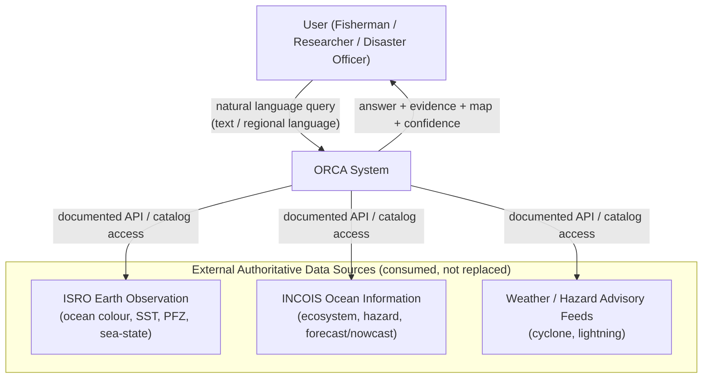
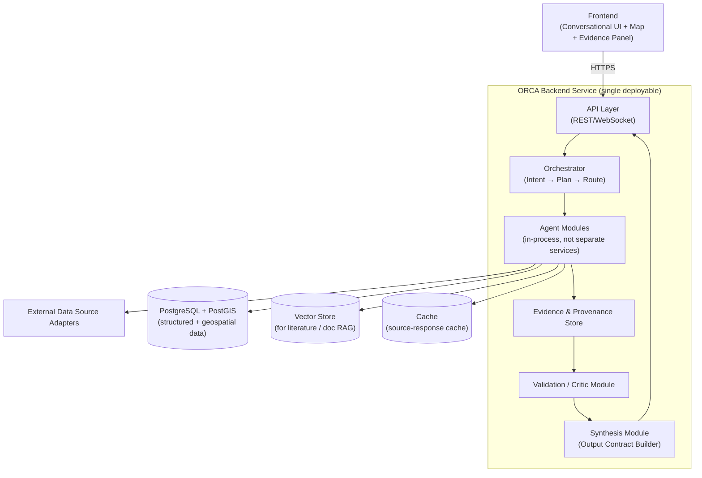
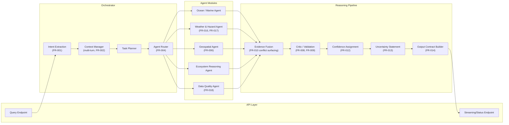
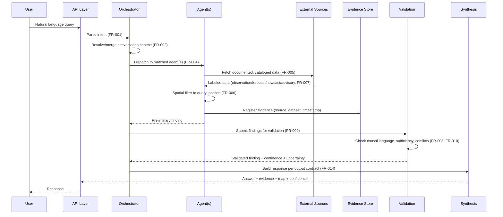
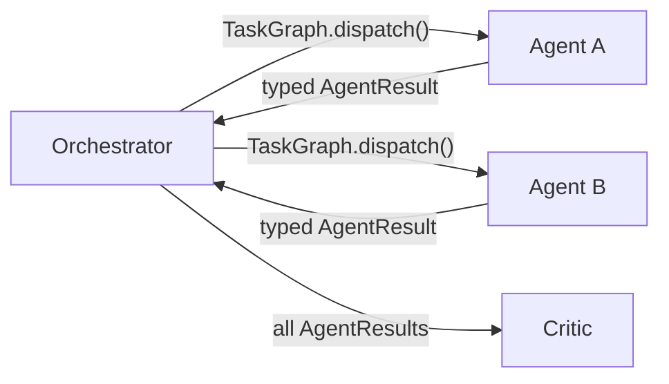
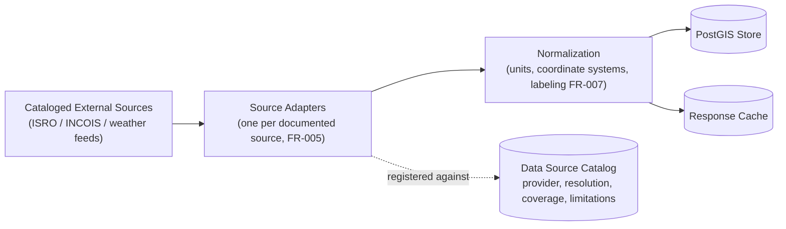
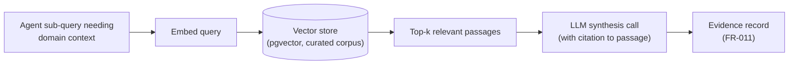
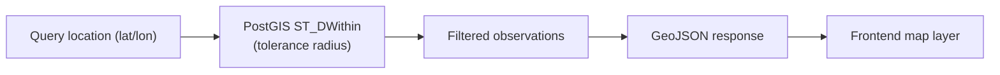
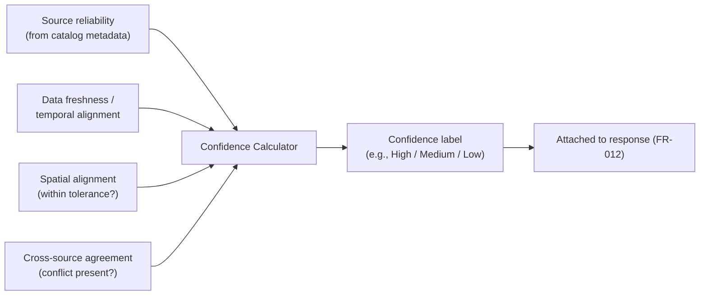
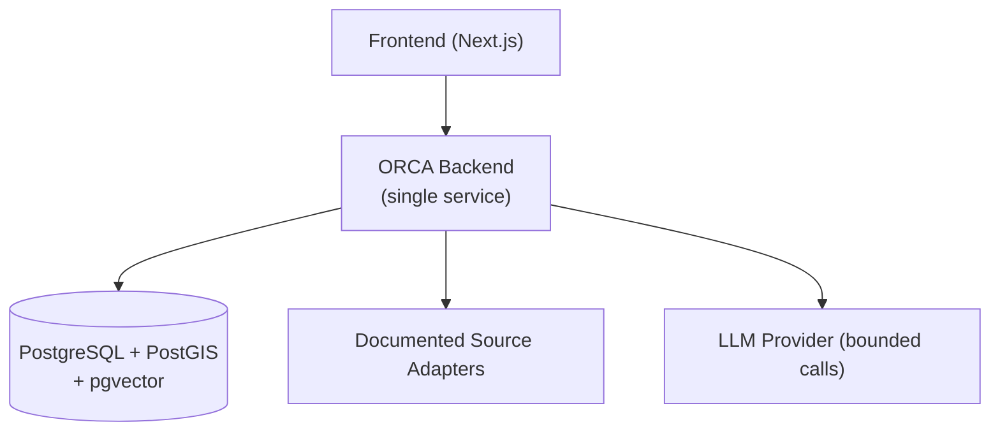

# SYSTEM_ARCHITECTURE.md

# ORCA — Marine Ecosystems Reasoning with Collaborative Agents
## System Architecture Document

**SIH Problem ID:** SIH26176
**Document Status:** Draft — derived from approved PRD.md, PROJECT_MASTER.md, PROBLEM_STATEMENT.md
**Version:** 1.0
**Last Updated:** 30 August 2026

---

## 0. Scope and Traceability Rule

Every architectural decision here maps to a requirement in `PRD.md` (FR-xxx / NFR-xxx) or an explicit design principle in `PROJECT_MASTER.md` §24 (P1–P8). Where an architectural choice is **not** driven by an approved requirement, it is marked **[SPECULATIVE — NOT INCLUDED]** and deliberately excluded, per the instruction to avoid technologically-interesting-but-unjustified additions.

Two architecture tracks are maintained throughout this document:

- 🟢 **PROTOTYPE** — what is actually built for the SIH demonstration, feasible within prototype time/compute constraints (PRD §13; PROJECT_MASTER.md §20.5).
- 🔵 **PRODUCTION EVOLUTION** — the direction the architecture could grow toward, per PRD §11 (Future Requirements). Nothing in this track is a current build commitment.

---

## 1. Architecture Overview

ORCA is architected as a **single reasoning service with internally modular agent logic**, not a distributed microservices system. This directly follows PROJECT_MASTER.md §15.7 ("exact infrastructure should be decided according to prototype requirements rather than prematurely locking the architecture") and PRD NFR-008 (cost/scale budget per query).

At the highest level, ORCA sits between the **user** and **existing authoritative marine data providers** (PRD §16 Out-of-Scope: ORCA does not replace ISRO/INCOIS, it orchestrates them):

```
User Question  →  ORCA (orchestration + reasoning)  →  Authoritative marine data sources
                              ↓
                 Evidence-grounded, explainable answer
```

Core architectural commitments (traced to PRD requirements):

| Commitment | Traces to |
|---|---|
| Every conclusion must be traceable to a named source | FR-011, NFR-002 |
| Reasoning passes through an explicit validation/critic stage | FR-009 |
| Data is labeled observation/forecast/nowcast/advisory, never merged silently | FR-007 |
| Conflicting source values are surfaced, not silently resolved | FR-010 |
| No causal language over correlation | FR-008, NFR-006 |
| Full orchestration is logged and auditable | NFR-005 |
| Agent invocation is minimized to control cost | NFR-008 |

---

## 2. Context Diagram



**Boundary rule (PRD §16, PROJECT_MASTER.md §10):** ORCA never issues its own hazard warning, never controls external infrastructure, and never claims authority over external data — it queries, labels, and reasons over what these systems publish (FR-016, FR-017).

---

## 3. System Architecture

🟢 **PROTOTYPE**

A single deployable backend service (**modular monolith**) with an internal agent layer, a thin frontend, and a Postgres/PostGIS datastore, rather than N independently-deployed microservices. This satisfies PRD's cost/latency NFRs (NFR-001, NFR-008) and keeps the audit surface (NFR-005) small.



🔵 **PRODUCTION EVOLUTION**: Individual agent modules could be split into separately scaled services (or serverless functions) if a specific agent becomes a throughput bottleneck — this is deferred, not designed in now, since no prototype-scale evidence justifies it (avoids §6 "excessive prototype complexity" risk, PROJECT_MASTER.md R6).

---

## 4. Component Architecture



Each agent module is a **function/class boundary**, not a network service — this keeps latency predictable (NFR-001) and avoids inter-service auth/networking overhead not justified at prototype scale.

---

## 5. Data Flow



---

## 6. Agent Communication

🟢 **PROTOTYPE**: Agents communicate via **direct in-process function calls with a shared typed context object**, not a message bus. The orchestrator holds a `TaskGraph` and calls each required agent synchronously (or via `asyncio` concurrency for independent sub-tasks), collecting typed results.

Rationale: PROJECT_MASTER.md explicitly warns against excessive complexity (R6) and against over-engineering agent count before it's justified (§23.2: "agents should only be added where they provide measurable analytical value"). A message queue / event bus between agents is not justified at this scale.



Each `AgentResult` carries: `claim`, `evidence[]`, `confidence`, `data_labels[]`, `spatial_scope`, `temporal_scope` — enforced by a shared schema so FR-011/FR-012/FR-007 are structurally guaranteed rather than left to prompt discipline alone.

🔵 **PRODUCTION EVOLUTION**: If agents are later split into separate services, communication would move to an internal RPC (gRPC) or event bus — deferred until throughput data justifies it.

---

## 7. Data Ingestion

🟢 **PROTOTYPE**



- Each adapter is bound to one catalog entry (PROJECT_MASTER.md §14.3: provider, access method, spatial/temporal resolution, coverage, limitations, licensing).
- Ingestion is **pull-based, on-demand per query** for the prototype (not a continuous streaming pipeline) — sufficient for demonstration scope and avoids unjustified streaming infrastructure (NFR-008).
- A short-TTL cache avoids redundant calls to the same source/region/time within a session, controlling cost.

🔵 **PRODUCTION EVOLUTION**: Scheduled/streaming ingestion, a data lake, and a feature layer (per PROJECT_MASTER.md §23.4) — not needed until real-time freshness at scale is an actual requirement.

---

## 8. Backend

🟢 **PROTOTYPE**

- Single backend service, Python-based (consistent with PROJECT_MASTER.md §15.2/§15.5's Python/data-science alignment — Pandas, Xarray, geospatial libraries).
- Exposes a REST endpoint for query submission and a streaming/status channel for progress (supports PRD's UX criterion of observing system progress, PROJECT_MASTER.md §19.4).
- Orchestrator, agents, validation, and synthesis run as in-process modules within this one service (Section 3).
- Stateless request handling; conversation context (FR-002) persisted externally (Section 9), not in backend process memory, so the service can restart without losing session context.

🔵 **PRODUCTION EVOLUTION**: API gateway, autoscaled backend replicas, background workers for long-running analytical jobs — introduced only if concurrent load requires it.

---

## 9. Database

🟢 **PROTOTYPE**

**PostgreSQL + PostGIS** as the single system-of-record database (per PROJECT_MASTER.md §15.4), holding:

| Table group | Purpose | Traces to |
|---|---|---|
| `data_source_catalog` | Provider, resolution, coverage, limitations | FR-005 |
| `observations` (PostGIS geometry columns) | Retrieved/normalized data points with `data_type` label | FR-006, FR-007 |
| `conversation_context` | Session-scoped location/time/intent memory | FR-002 |
| `evidence_records` | Claim → source → dataset → calculation chain | FR-011 |
| `orchestration_logs` | Agents invoked, sources queried, validation steps | NFR-005 |
| `conflicts` | Detected cross-source disagreements | FR-010 |

PostGIS is used (not a bespoke geo engine) because spatial filtering (FR-006) and map rendering (FR-015) are core, recurring operations best served by a mature, indexable geospatial extension — a justified, non-speculative choice.

🔵 **PRODUCTION EVOLUTION**: Time-series-optimized storage (e.g., a dedicated time-series extension/database) if data volume/query patterns outgrow PostGIS's time-series performance — not needed at prototype scale.

---

## 10. Vector Database

🟢 **PROTOTYPE — narrow, justified use only**

A vector store is included **only** to support Retrieval-Augmented Generation over a small, curated corpus of scientific literature / domain reference text (PROJECT_MASTER.md §14.2 "Contextual Data → Scientific literature"), used when an agent needs supporting domain context beyond raw numeric observations (e.g., interpreting what a chlorophyll threshold typically indicates).

- Scope: a small, versioned, curated document set (not open web crawling — PROJECT_MASTER.md §14.1 explicitly avoids uncontrolled scraping).
- Implementation: a lightweight embedded/managed vector index (e.g., pgvector extension on the existing PostgreSQL instance) rather than a separate vector database service — avoids adding a new operational component for a narrow use case.

**[SPECULATIVE — NOT INCLUDED]**: A large-scale, continuously-crawled vector corpus is not justified for the prototype and is excluded.

🔵 **PRODUCTION EVOLUTION**: A dedicated vector database service if the literature corpus and query volume grow substantially.

---

## 11. Knowledge Graph

**Justification check (per instruction: "if justified"):** PRD's approved requirements (FR-001–FR-018) do not require multi-hop relational reasoning over an explicit entity graph; PROJECT_MASTER.md lists knowledge graphs only under §23.3 **Future/Advanced Reasoning**, explicitly not a current commitment.

**Decision: NOT included in the prototype architecture.** A knowledge graph would be premature complexity relative to approved requirements — it does not trace to any FR/NFR in the approved PRD.

🔵 **PRODUCTION EVOLUTION**: A scientific knowledge graph (linking variables, ecological relationships, and literature) is listed as a future capability (PROJECT_MASTER.md §23.3) and could justify a graph database once causal-inference and cross-domain relationship reasoning become approved requirements — not before.

---

## 12. RAG (Retrieval-Augmented Generation)

🟢 **PROTOTYPE**

RAG is scoped narrowly and used for exactly one purpose: grounding an agent's natural-language explanation in curated reference text (not for retrieving numeric observations, which come from the structured PostGIS/adapter path in Sections 7–9).



- Retrieved passages are always attached to the evidence record (FR-011) — RAG output is never presented without its source, and per copyright/quotation limits, is paraphrased rather than quoted at length in user-facing text.
- RAG is **not** used to retrieve or fabricate numeric marine data — numeric values only come from the ingestion path (Section 7), preventing the LLM from inventing observation values.

---

## 13. LLM Layer

🟢 **PROTOTYPE**

The LLM layer performs three bounded roles, each with a narrow, checkable output contract — it does not freely generate the full response end-to-end.

| Role | Input | Output (structured) | Constraint enforced |
|---|---|---|---|
| Intent extraction | User query text | `{location, time, intent_type}` | FR-001 |
| Agent-level explanation | Structured agent data (numbers, labels) | Natural-language claim + confidence | Must cite `evidence[]` (FR-011); causal-language filter applied (FR-008, NFR-006) |
| Synthesis | All validated `AgentResult`s | Output-contract-shaped final answer | Must populate all 8 sections (FR-014) |

- Model/provider selection remains open per PROJECT_MASTER.md Q10 — this architecture is provider-agnostic (implementation independence, P8).
- A deterministic post-processing filter checks LLM output for unqualified causal phrasing before it reaches the user (NFR-006), rather than relying on prompting alone.
- Numeric transformations (averages, anomaly thresholds, trend detection) are computed in code (Pandas/Xarray/NumPy per PROJECT_MASTER.md §15.5), **not** by the LLM — the LLM explains pre-computed numbers, it does not compute them, reducing hallucination risk (R1).

---

## 14. Geospatial Layer

🟢 **PROTOTYPE**

- PostGIS provides spatial indexing, radius/region filtering (FR-006), and geometry storage for observations and query locations.
- Map rendering (FR-015) is served by the frontend using a standard web mapping library, fed by the backend's GeoJSON output.
- Spatial tolerance (the "documented tolerance radius" in FR-006) is a configurable parameter per data source, since resolution varies by dataset (PROJECT_MASTER.md §14.3).



---

## 15. Frontend

🟢 **PROTOTYPE**

A single web frontend (Next.js/React per PROJECT_MASTER.md §15.1) with three coordinated panels, directly mapped to PRD user-journey needs (PRD §5):

1. **Conversational panel** — query input/output, multi-turn (FR-001–FR-003).
2. **Map panel** — spatial visualization of evidence/observations (FR-015).
3. **Evidence panel** — expandable list of sources, confidence, uncertainty per conclusion (FR-011–FR-013), satisfying the researcher persona's need to inspect the evidence chain (PRD §3, Persona 2).

Progress indication (PROJECT_MASTER.md §19.4) is driven by the backend's streaming/status channel (Section 8) so the user can observe orchestration progress rather than a blank wait.

---

## 16. External Data Sources

**[OFFICIAL sources, per PROBLEM_STATEMENT.md §28 and PROJECT_MASTER.md §14]** — consumed via documented adapters (Section 7), never re-hosted or claimed as ORCA's own:

- ISRO Earth Observation products (ocean colour, SST-related, sea-state, PFZ-related outputs)
- INCOIS ocean information services (ecosystem services, hazard/multi-hazard, forecast/nowcast)
- National weather/hazard advisory feeds (cyclone, lightning)

Each source requires a catalog entry before use (FR-005). Sources not yet cataloged are out of scope until documented — this prevents undocumented/uncontrolled data integration (PRD §16).

---

## 17. Evidence Layer

🟢 **PROTOTYPE**

A dedicated `evidence_records` structure (Section 9) implements the provenance chain from PROJECT_MASTER.md §14.4:

```
Source → Dataset → Query → Transformation → Analysis → Result
```

Every `AgentResult` (Section 6) must populate this chain before it can pass validation (Section 18). The evidence panel (Section 15) renders this chain directly — evidence is a first-class, user-visible object (PROJECT_MASTER.md §16.3), not a backend-only log.

---

## 18. Verification Layer

🟢 **PROTOTYPE**

A dedicated Critic/Validation module (Section 4) runs **after** all agents return and **before** synthesis, performing checks that are each individually testable against PRD acceptance criteria:

| Check | Traces to |
|---|---|
| Causal-language scan | FR-008, NFR-006 |
| Cross-source conflict detection | FR-010 |
| Evidence completeness (every claim has ≥1 source) | FR-011 |
| Data label completeness (no unlabeled data type) | FR-007 |
| Data-quality flag propagation | FR-018 |

A finding that fails a check is either sent back to the originating agent for revision (bounded retry count, to protect NFR-001 latency) or surfaced to the user as an explicit uncertainty statement (FR-013) rather than silently dropped or silently passed.

---

## 19. Confidence Layer

🟢 **PROTOTYPE**

Confidence is computed deterministically from evidence properties, not asserted freely by the LLM:



This satisfies FR-012 while avoiding an unjustified numeric-probability claim the system cannot scientifically support (P5, PROJECT_MASTER.md §24: "Uncertainty Is a Feature").

---

## 20. Monitoring

🟢 **PROTOTYPE — minimal, justified by NFR-005**

- **Orchestration logs** (Section 9 `orchestration_logs` table): agents invoked, sources queried, validation steps, timing — directly required by NFR-005 and the demonstration acceptance criterion (PRD §10).
- **Latency tracking** per query stage, to evaluate NFR-001 (p95 response time).
- **Agent invocation counter**, to evaluate NFR-008 (cost budget).
- **Evidence-audit script** (referenced in NFR-002/NFR-006 acceptance criteria) run against a benchmark query set.

**[SPECULATIVE — NOT INCLUDED]**: Full observability stack (distributed tracing, dashboards, alerting infrastructure) is not justified for a single-service prototype; structured logs plus a benchmark script satisfy the approved NFRs.

🔵 **PRODUCTION EVOLUTION**: Standard observability stack (metrics, tracing, alerting) once the system is operationally deployed (PROJECT_MASTER.md §15.7).

---

## 21. Security

🟢 **PROTOTYPE — scoped to what approved requirements require**

- **Source credentials**: API keys/credentials for external data sources stored in a secrets manager / environment configuration, never in code or logs.
- **Input validation**: Query input sanitized before reaching the LLM layer and before any downstream database query, to prevent injection.
- **No user PII requirement**: The approved PRD does not define an account/authentication system as a requirement; the prototype does not invent one. If session-based conversation context (FR-002) requires a session identifier, it is an opaque, non-PII session token, not a persistent user profile.
- **Attribution integrity**: Hazard/alert content (FR-016/FR-017) is stored with an immutable source-attribution field to prevent the appearance of ORCA-originated hazard claims.
- **Least-privilege data access**: Backend service credentials scoped only to the data source catalog and datastore it needs.

**[SPECULATIVE — NOT INCLUDED]**: Multi-tenant auth, RBAC, and enterprise SSO are not required by any approved FR/NFR and are excluded from the prototype.

🔵 **PRODUCTION EVOLUTION**: Full authentication/authorization, institutional access controls, and security review would be required before any operational integration (PROJECT_MASTER.md §23.5 explicitly requires "appropriate institutional authorization, validation, security, and governance").

---

## 22. Failure Handling

🟢 **PROTOTYPE**

| Failure | Handling | Traces to |
|---|---|---|
| External data source unreachable | Explicitly inform user that data category is unavailable; do not fabricate a value | NFR-004 |
| Conflicting source values | Surface conflict explicitly rather than silently resolving | FR-010 |
| Agent produces claim without evidence | Blocked at validation layer; not passed to synthesis | FR-011, Section 18 |
| LLM produces causal language | Caught by deterministic post-filter; rewritten or flagged before output | FR-008, NFR-006 |
| Insufficient evidence to answer | Uncertainty statement generated instead of a forced conclusion | FR-013 |
| Validation retry limit exceeded | Response returned with explicit "unable to fully validate" note rather than blocking indefinitely | Protects NFR-001 |

This is a **graceful degradation** philosophy throughout: every failure path produces a truthful, bounded response rather than a silent wrong answer or an unbounded retry loop.

---

## 23. Prototype Architecture (Summary)

🟢 Single modular-monolith backend (Python) + PostgreSQL/PostGIS (with pgvector for narrow RAG use) + thin Next.js frontend + a small set of documented external-source adapters + in-process agent modules communicating via typed function calls + deterministic validation/confidence/output-contract layers wrapping bounded LLM calls.

No message queue, no knowledge graph, no microservices, no multi-tenant auth, no streaming ingestion pipeline — each of these was evaluated above and excluded because it does not trace to an approved FR/NFR at prototype scale.



---

## 24. Production Evolution

🔵 Each evolution step below is explicitly gated on a **future, not-yet-approved requirement** from PRD §11, and is not designed in detail here — only the direction is noted, per PROJECT_MASTER.md P8 (implementation independence) and P7 (modular architecture: agents/services replaceable without redesign).

| Prototype element | Possible production evolution | Gated on |
|---|---|---|
| In-process agent modules | Independently scaled services (gRPC/event bus) | Demonstrated per-agent throughput bottleneck |
| Pull-based, on-demand ingestion | Scheduled/streaming ingestion, data lake | Real-time freshness requirement approved |
| pgvector narrow RAG | Dedicated vector database service | Literature corpus/query volume growth |
| No knowledge graph | Scientific knowledge graph | Approved causal/cross-domain relationship reasoning requirement |
| Minimal structured logging | Full observability stack (tracing, dashboards, alerting) | Operational deployment |
| No auth system | Institutional authentication/authorization, RBAC | Operational integration with institutional systems (requires authorization per §23.5) |
| Single-region prototype dataset | Multi-region / national-scale coverage | Validated data availability across regions (A1, A2 in PROJECT_MASTER.md §30) |
| Manual regional-language support (if included) | Full multilingual NLP pipeline | FR-003 validated as feasible at scale |

The architectural principle carried into every evolution step: **the conceptual ORCA architecture (Sections 2–6) remains valid regardless of the specific language, framework, database, model provider, or deployment platform chosen** (P8, PROJECT_MASTER.md §24).

---

*End of SYSTEM_ARCHITECTURE.md*