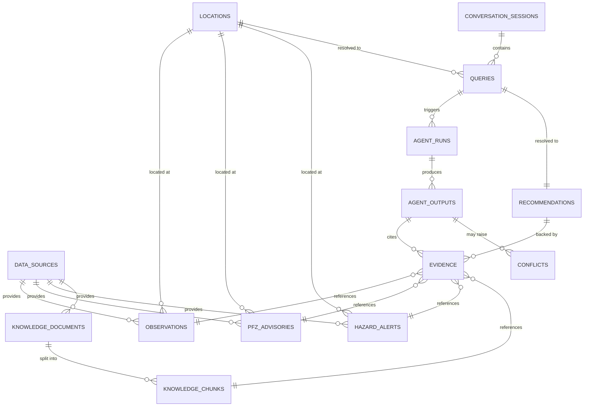

# DATABASE_SCHEMA.md

# ORCA — Marine Ecosystems Reasoning with Collaborative Agents
## Database Schema

**SIH Problem ID:** SIH26176
**Document Status:** Draft — derived from approved PRD.md, SYSTEM_ARCHITECTURE.md, AGENT_ARCHITECTURE.md
**Version:** 1.0
**Last Updated:** 30 August 2026

---

## 0. Design Philosophy and Reconciliation Note

This schema implements the storage layer already described conceptually in `SYSTEM_ARCHITECTURE.md §9` and referenced by every agent in `AGENT_ARCHITECTURE.md`. Two deliberate simplifications keep it prototype-feasible rather than prematurely complex:

1. **One generalized `observations` table, not one table per variable.** SST, wave height, current speed, chlorophyll, and tide share an identical structural shape (a numeric value, a unit, a location, a time, a data-type label, a source). Creating five near-identical tables (`sst_readings`, `wave_readings`, `current_readings`, `chlorophyll_readings`, `tide_readings`) would duplicate the same columns, the same indexes, and the same constraints five times for no query or integrity benefit — this is exactly the kind of premature complexity the brief asks to avoid. A `variable_type` discriminator column plus a check constraint achieves the same conceptual separation with one schema to maintain.
2. **PFZ and hazard alerts get their own tables**, unlike the raw variables above — because they are not raw measurements. PFZ advisories are a derived, officially-issued product (`AGENT_ARCHITECTURE.md §3`), and hazard alerts carry an absolute non-fabrication constraint with mandatory attribution fields (`AGENT_ARCHITECTURE.md §4`, FR-016/FR-017) that a generic observation row does not need to carry. These are genuinely different entities, not the same entity twice.
3. **No `users` table.** Per `SYSTEM_ARCHITECTURE.md §21`, the approved PRD defines no account/authentication requirement. The only per-session need is FR-002's multi-turn context, satisfied by an opaque `conversation_sessions` table with no personal data — see §12.

Every table below traces to at least one FR/NFR or one agent responsibility; where a column exists purely to satisfy a specific acceptance criterion, that is noted inline.

---

## 1. Entity-Relationship Overview



---

## 2. `data_sources`

**Purpose:** The data source catalog — every source must be registered here before any agent may retrieve from it (FR-005).

| Column | Type | Notes |
|---|---|---|
| `source_id` | `UUID` | **Primary Key**, default `gen_random_uuid()` |
| `provider_name` | `TEXT NOT NULL` | e.g., "ISRO", "INCOIS" |
| `dataset_name` | `TEXT NOT NULL` | |
| `access_method` | `TEXT NOT NULL` | e.g., "REST API", "file feed" |
| `spatial_resolution` | `TEXT` | documented resolution, e.g., "4 km grid" |
| `spatial_tolerance_m` | `NUMERIC` | numeric tolerance radius used by `ST_DWithin` filtering (AGENT_ARCHITECTURE.md §5) |
| `temporal_resolution` | `TEXT` | e.g., "daily", "hourly" |
| `coverage_region` | `GEOGRAPHY(POLYGON, 4326)` | spatial coverage extent (PostGIS) |
| `known_limitations` | `TEXT` | |
| `license` | `TEXT` | |
| `reliability_tier` | `SMALLINT NOT NULL DEFAULT 2` | 1 = highest reliability, used by Confidence Calculator |
| `is_active` | `BOOLEAN NOT NULL DEFAULT TRUE` | disables a source without deleting history |
| `created_at` | `TIMESTAMPTZ NOT NULL DEFAULT now()` | |
| `updated_at` | `TIMESTAMPTZ NOT NULL DEFAULT now()` | |

**Constraints:** `UNIQUE (provider_name, dataset_name)` — prevents duplicate catalog entries.
**Indexes:** B-tree on `provider_name`; GiST on `coverage_region`.

---

## 3. `locations`

**Purpose:** Canonical resolved geometries produced by the Geospatial Agent (`AGENT_ARCHITECTURE.md §5`) — reused across observations, advisories, alerts, and queries rather than re-resolving/re-storing raw coordinates everywhere.

| Column | Type | Notes |
|---|---|---|
| `location_id` | `UUID` | **Primary Key** |
| `raw_query_text` | `TEXT` | original place name/string, nullable if resolved from coordinates directly |
| `geom` | `GEOGRAPHY(POINT, 4326) NOT NULL` | canonical resolved point (PostGIS) |
| `region_name` | `TEXT` | e.g., "Arabian Sea", "Bay of Bengal" — for reporting/filtering |
| `resolution_method` | `TEXT NOT NULL` | `'exact_coordinates'` \| `'gazetteer_match'` \| `'fuzzy_match'` |
| `resolution_confidence` | `NUMERIC CHECK (resolution_confidence BETWEEN 0 AND 1)` | feeds Confidence Calculator |
| `created_at` | `TIMESTAMPTZ NOT NULL DEFAULT now()` | |

**Indexes:** GiST spatial index on `geom` (mandatory — this is the most frequently spatially filtered table).

---

## 4. `observations`

**Purpose:** The generalized store for SST, waves, currents, chlorophyll, and tide/wind readings retrieved by the Ocean and Ecosystem Agents. One table, discriminated by `variable_type`, per the design-philosophy note in §0.

| Column | Type | Notes |
|---|---|---|
| `observation_id` | `UUID` | **Primary Key** |
| `source_id` | `UUID NOT NULL` | **Foreign Key** → `data_sources(source_id)` |
| `location_id` | `UUID NOT NULL` | **Foreign Key** → `locations(location_id)` |
| `geom` | `GEOGRAPHY(POINT, 4326) NOT NULL` | duplicated from location for direct spatial indexing on this high-volume table (see §17) |
| `variable_type` | `TEXT NOT NULL` | `CHECK (variable_type IN ('sst','wave_height','current_speed','current_direction','chlorophyll','tide_level','wind_speed','wind_direction'))` |
| `value` | `NUMERIC NOT NULL` | |
| `unit` | `TEXT NOT NULL` | normalized unit label (e.g., `'celsius'`, `'m'`, `'mg_m3'`) |
| `data_type` | `TEXT NOT NULL` | `CHECK (data_type IN ('observation','forecast','nowcast','advisory'))` — enforces FR-007 at the schema level |
| `observed_at` | `TIMESTAMPTZ NOT NULL` | the time the value applies to |
| `valid_until` | `TIMESTAMPTZ` | nullable; populated for forecast/nowcast rows |
| `retrieved_at` | `TIMESTAMPTZ NOT NULL DEFAULT now()` | when ORCA fetched it — used for freshness scoring |
| `quality_flag` | `TEXT` | `CHECK (quality_flag IN ('ok','stale','resolution_mismatch','missing_metadata'))`, nullable, set by Data Quality checks (FR-018) |
| `raw_payload` | `JSONB` | original source payload for audit/debug, not used in reasoning directly |

**Constraints:** `UNIQUE (source_id, location_id, variable_type, observed_at, data_type)` — prevents duplicate ingestion of the same reading.
**Indexes:**
- GiST on `geom` (spatial filtering, FR-006)
- B-tree on `(variable_type, observed_at)` (temporal queries per variable)
- B-tree on `source_id`

---

## 5. `pfz_advisories`

**Purpose:** Official Potential-Fishing-Zone-type advisory products consumed by the Fisheries Agent (`AGENT_ARCHITECTURE.md §3`). Kept separate from `observations` because it is a derived, officially-issued advisory, not a raw measured variable, and carries its own reference/document fields.

| Column | Type | Notes |
|---|---|---|
| `advisory_id` | `UUID` | **Primary Key** |
| `source_id` | `UUID NOT NULL` | **Foreign Key** → `data_sources(source_id)` |
| `location_id` | `UUID NOT NULL` | **Foreign Key** → `locations(location_id)` |
| `zone_geom` | `GEOGRAPHY(POLYGON, 4326) NOT NULL` | the advised zone extent |
| `issued_at` | `TIMESTAMPTZ NOT NULL` | |
| `valid_until` | `TIMESTAMPTZ NOT NULL` | PFZ advisories are inherently time-bound |
| `advisory_reference` | `TEXT NOT NULL` | official document/bulletin identifier |
| `contributing_variables` | `JSONB` | e.g., `{"sst_range": [...], "chlorophyll_threshold": ...}` — documents which inputs justified the advisory, per Fisheries Agent's Rules (§3) |
| `retrieved_at` | `TIMESTAMPTZ NOT NULL DEFAULT now()` | |

**Constraints:** `CHECK (valid_until > issued_at)`.
**Indexes:** GiST on `zone_geom`; B-tree on `(issued_at, valid_until)` for temporal validity queries.

---

## 6. `hazard_alerts`

**Purpose:** The Safety Agent's exclusive domain (`AGENT_ARCHITECTURE.md §4`). Distinct table because every row must carry non-null attribution — the absolute non-fabrication rule (FR-017) is enforced structurally here via a `NOT NULL` constraint, not left to application logic alone.

| Column | Type | Notes |
|---|---|---|
| `alert_id` | `UUID` | **Primary Key** |
| `source_id` | `UUID NOT NULL` | **Foreign Key** → `data_sources(source_id)` — `NOT NULL` enforces FR-016's mandatory attribution at the schema level |
| `alert_type` | `TEXT NOT NULL` | `CHECK (alert_type IN ('cyclone','lightning','high_wave','storm_surge','geofence_restriction'))` |
| `affected_area` | `GEOGRAPHY(POLYGON, 4326) NOT NULL` | |
| `severity_as_stated` | `TEXT` | severity **as reported by the source**, never inferred by ORCA (Safety Agent Rules, §4) |
| `issued_at` | `TIMESTAMPTZ NOT NULL` | |
| `valid_until` | `TIMESTAMPTZ NOT NULL` | |
| `source_reference` | `TEXT NOT NULL` | bulletin/advisory identifier from the issuing authority |
| `retrieved_at` | `TIMESTAMPTZ NOT NULL DEFAULT now()` | |

**Constraints:** `CHECK (valid_until >= issued_at)`; `source_id` and `source_reference` both `NOT NULL` (double-enforces attribution).
**Indexes:** GiST on `affected_area`; B-tree on `(alert_type, issued_at, valid_until)`.

---

## 7. `knowledge_documents`

**Purpose:** The curated reference corpus registry for the Knowledge/RAG Agent (`AGENT_ARCHITECTURE.md §6`) — kept small and versioned, never an open crawl (per `PROJECT_MASTER.md §14.1`).

| Column | Type | Notes |
|---|---|---|
| `document_id` | `UUID` | **Primary Key** |
| `title` | `TEXT NOT NULL` | |
| `source_reference` | `TEXT NOT NULL` | citation/provenance |
| `version` | `TEXT NOT NULL` | |
| `added_at` | `TIMESTAMPTZ NOT NULL DEFAULT now()` | |

**Indexes:** B-tree on `title`.

---

## 8. `knowledge_chunks`

**Purpose:** Embedded passages for similarity search — the **only** table using `pgvector` in this schema, scoped narrowly per `SYSTEM_ARCHITECTURE.md §10, §12`.

| Column | Type | Notes |
|---|---|---|
| `chunk_id` | `UUID` | **Primary Key** |
| `document_id` | `UUID NOT NULL` | **Foreign Key** → `knowledge_documents(document_id)` |
| `chunk_text` | `TEXT NOT NULL` | |
| `chunk_order` | `INTEGER NOT NULL` | position within the source document |
| `embedding` | `VECTOR(1536)` | pgvector column; dimension matches the chosen embedding model (provider-agnostic per P8 — dimension configurable at deployment) |

**Indexes:** IVFFlat (or HNSW, depending on pgvector version available) index on `embedding` for approximate nearest-neighbor search; B-tree on `document_id`.
**Constraint note:** No numeric marine value is ever stored in this table — enforced by convention and by the Knowledge/RAG Agent's forbidden responsibilities (`AGENT_ARCHITECTURE.md §6`), not by a schema constraint, since `chunk_text` is free text by nature.

---

## 9. `conversation_sessions`

**Purpose:** Satisfies FR-002's multi-turn context requirement without introducing a user-account system (§0, point 3).

| Column | Type | Notes |
|---|---|---|
| `session_id` | `UUID` | **Primary Key** — opaque token, no personal data |
| `last_location_id` | `UUID` | **Foreign Key** → `locations(location_id)`, nullable |
| `last_time_window` | `TSTZRANGE` | last resolved time window, for follow-up merging |
| `created_at` | `TIMESTAMPTZ NOT NULL DEFAULT now()` | |
| `last_active_at` | `TIMESTAMPTZ NOT NULL DEFAULT now()` | |
| `expires_at` | `TIMESTAMPTZ NOT NULL` | short TTL; sessions are not retained indefinitely |

**Indexes:** B-tree on `expires_at` (for cleanup jobs).

---

## 10. `queries`

**Purpose:** One row per user question submitted — the anchor record tying a session to its orchestration run and final recommendation.

| Column | Type | Notes |
|---|---|---|
| `query_id` | `UUID` | **Primary Key** |
| `session_id` | `UUID NOT NULL` | **Foreign Key** → `conversation_sessions(session_id)` |
| `raw_text` | `TEXT NOT NULL` | original user query |
| `language` | `TEXT NOT NULL DEFAULT 'en'` | supports FR-003 |
| `intent_type` | `TEXT` | e.g., `'fishing_safety'`, `'anomaly_check'`, `'hazard_check'` |
| `resolved_location_id` | `UUID` | **Foreign Key** → `locations(location_id)`, nullable until resolved |
| `resolved_time_window` | `TSTZRANGE` | |
| `submitted_at` | `TIMESTAMPTZ NOT NULL DEFAULT now()` | |

**Indexes:** B-tree on `session_id`; B-tree on `submitted_at`.

---

## 11. `agent_runs`

**Purpose:** One row per agent invocation within a query's orchestration — the structured backbone of the orchestration log (NFR-005), reconciling `SYSTEM_ARCHITECTURE.md §9`'s `orchestration_logs` concept into a queryable table.

| Column | Type | Notes |
|---|---|---|
| `run_id` | `UUID` | **Primary Key** |
| `query_id` | `UUID NOT NULL` | **Foreign Key** → `queries(query_id)` |
| `agent_name` | `TEXT NOT NULL` | `CHECK (agent_name IN ('ocean','ecosystem','fisheries','safety','geospatial','knowledge_rag','verification','coordinator'))` |
| `started_at` | `TIMESTAMPTZ NOT NULL DEFAULT now()` | |
| `completed_at` | `TIMESTAMPTZ` | nullable until finished |
| `status` | `TEXT NOT NULL DEFAULT 'running'` | `CHECK (status IN ('running','completed','failed','timeout','data_unavailable'))` |
| `execution_mode` | `TEXT` | `'parallel'` \| `'sequential'` — records which orchestration path was used (AGENT_ARCHITECTURE.md §10–§11), for audit |
| `depends_on_run_id` | `UUID` | **Foreign Key** → `agent_runs(run_id)`, nullable, self-referencing — records sequential dependency |

**Indexes:** B-tree on `query_id`; B-tree on `(agent_name, status)`.

---

## 12. `agent_outputs`

**Purpose:** The structured `AgentResult` object each agent produces (`AGENT_ARCHITECTURE.md §9, §12`), before and after Verification.

| Column | Type | Notes |
|---|---|---|
| `output_id` | `UUID` | **Primary Key** |
| `run_id` | `UUID NOT NULL` | **Foreign Key** → `agent_runs(run_id)` |
| `claim_text` | `TEXT NOT NULL` | the natural-language finding |
| `confidence_label` | `TEXT` | `CHECK (confidence_label IN ('high','medium','low'))`, nullable until Confidence Calculator runs |
| `spatial_scope_id` | `UUID` | **Foreign Key** → `locations(location_id)` |
| `temporal_scope` | `TSTZRANGE` | |
| `validation_status` | `TEXT NOT NULL DEFAULT 'pending'` | `CHECK (validation_status IN ('pending','passed','blocked'))` |
| `validation_failure_reason` | `TEXT` | nullable, populated only if `blocked` |
| `created_at` | `TIMESTAMPTZ NOT NULL DEFAULT now()` | |

**Indexes:** B-tree on `run_id`; B-tree on `validation_status`.

---

## 13. `evidence`

**Purpose:** The provenance chain — every claim must resolve to ≥1 row here (FR-011, NFR-002). This is the table the evidence-audit script (NFR-002 acceptance criterion) queries directly.

| Column | Type | Notes |
|---|---|---|
| `evidence_id` | `UUID` | **Primary Key** |
| `output_id` | `UUID NOT NULL` | **Foreign Key** → `agent_outputs(output_id)` |
| `observation_id` | `UUID` | **Foreign Key** → `observations(observation_id)`, nullable |
| `advisory_id` | `UUID` | **Foreign Key** → `pfz_advisories(advisory_id)`, nullable |
| `alert_id` | `UUID` | **Foreign Key** → `hazard_alerts(alert_id)`, nullable |
| `chunk_id` | `UUID` | **Foreign Key** → `knowledge_chunks(chunk_id)`, nullable |
| `created_at` | `TIMESTAMPTZ NOT NULL DEFAULT now()` | |

**Constraint:** `CHECK (num_nonnulls(observation_id, advisory_id, alert_id, chunk_id) = 1)` — every evidence row must point to exactly one of the four possible source-of-truth tables, never zero (unsupported claim, blocked by Verification) and never more than one (ambiguous provenance).
**Indexes:** B-tree on `output_id` (this is the query path for the evidence-audit script).

---

## 14. `conflicts`

**Purpose:** Verification Agent's permanent, queryable conflict record (`AGENT_ARCHITECTURE.md §7, §13`; FR-010).

| Column | Type | Notes |
|---|---|---|
| `conflict_id` | `UUID` | **Primary Key** |
| `query_id` | `UUID NOT NULL` | **Foreign Key** → `queries(query_id)` |
| `variable_type` | `TEXT NOT NULL` | |
| `location_id` | `UUID NOT NULL` | **Foreign Key** → `locations(location_id)` |
| `observation_id_a` | `UUID NOT NULL` | **Foreign Key** → `observations(observation_id)` |
| `observation_id_b` | `UUID NOT NULL` | **Foreign Key** → `observations(observation_id)` |
| `difference_magnitude` | `NUMERIC NOT NULL` | |
| `documented_tolerance` | `NUMERIC NOT NULL` | the threshold that was exceeded, for auditability |
| `detected_at` | `TIMESTAMPTZ NOT NULL DEFAULT now()` | |
| `surfaced_to_user` | `BOOLEAN NOT NULL DEFAULT FALSE` | flips to `TRUE` once included in a response — used to verify no conflict is silently dropped |

**Constraint:** `CHECK (observation_id_a <> observation_id_b)`.
**Indexes:** B-tree on `query_id`; B-tree on `surfaced_to_user` (audit query: "any conflict never surfaced?").

---

## 15. `recommendations`

**Purpose:** The final, assembled output-contract response for a query (FR-014) — one row per query, the record the frontend's evidence panel renders from.

| Column | Type | Notes |
|---|---|---|
| `recommendation_id` | `UUID` | **Primary Key** |
| `query_id` | `UUID NOT NULL UNIQUE` | **Foreign Key** → `queries(query_id)` — one recommendation per query |
| `observations_section` | `TEXT NOT NULL` | |
| `analysis_section` | `TEXT NOT NULL` | |
| `evidence_summary` | `TEXT NOT NULL` | human-readable summary; full detail lives in `evidence` |
| `confidence_label` | `TEXT NOT NULL` | `CHECK (confidence_label IN ('high','medium','low'))` |
| `uncertainty_section` | `TEXT NOT NULL` | required even when empty of gaps — must state "no significant uncertainty identified" rather than being omitted (FR-014) |
| `implications_section` | `TEXT` | nullable — "not applicable" is a valid stored value |
| `recommended_next_step` | `TEXT` | nullable — "not applicable" is a valid stored value |
| `generated_at` | `TIMESTAMPTZ NOT NULL DEFAULT now()` | |

**Indexes:** B-tree on `query_id` (already unique-indexed via the constraint).

---

## 16. Full Table Summary

| Table | Uses PostGIS | Uses pgvector | Primary Key |
|---|---|---|---|
| `data_sources` | Yes (`coverage_region`) | No | `source_id` |
| `locations` | Yes (`geom`) | No | `location_id` |
| `observations` | Yes (`geom`) | No | `observation_id` |
| `pfz_advisories` | Yes (`zone_geom`) | No | `advisory_id` |
| `hazard_alerts` | Yes (`affected_area`) | No | `alert_id` |
| `knowledge_documents` | No | No | `document_id` |
| `knowledge_chunks` | No | Yes (`embedding`) | `chunk_id` |
| `conversation_sessions` | No | No | `session_id` |
| `queries` | No (references `locations`) | No | `query_id` |
| `agent_runs` | No | No | `run_id` |
| `agent_outputs` | No | No | `output_id` |
| `evidence` | No | No | `evidence_id` |
| `conflicts` | No | No | `conflict_id` |
| `recommendations` | No | No | `recommendation_id` |

14 tables total. No table was added without a distinct responsibility traced to an FR/NFR or agent role above — this is deliberately the smallest schema that satisfies the approved requirements, consistent with the instruction to avoid premature complexity.

---

## 17. PostGIS Usage

PostGIS is used for exactly the operations that are genuinely spatial, and nowhere else:

- **`GEOGRAPHY(POINT, 4326)`** is used (not `GEOMETRY`) for point data, because it correctly computes real-world distances in meters over the Earth's curvature — important given India's coastline spans a wide longitude range (`PROBLEM_STATEMENT.md §13`), where a flat-plane `GEOMETRY` distance calculation would introduce error.
- **`GEOGRAPHY(POLYGON, 4326)`** is used for area-based entities (`coverage_region`, `zone_geom`, `affected_area`) where a bounded region, not a single point, is the natural representation.
- **Duplication of `geom` onto `observations`** (rather than always joining through `locations`) is a deliberate denormalization: `observations` is the highest-volume, most spatially-filtered table (every Ocean/Ecosystem Agent call filters it), so avoiding a join on the hot path is justified. Every other table with a spatial column keeps a foreign key to `locations` instead, since they are lower-volume.

---

## 18. Spatial Queries

The dominant spatial query pattern, used by the Geospatial Agent on behalf of every domain agent (`AGENT_ARCHITECTURE.md §5`), is a tolerance-radius filter:

```sql
SELECT *
FROM observations
WHERE variable_type = 'sst'
  AND ST_DWithin(
        geom,
        (SELECT geom FROM locations WHERE location_id = :query_location_id),
        (SELECT spatial_tolerance_m FROM data_sources WHERE source_id = observations.source_id)
      );
```

This directly implements FR-006's acceptance criterion ("no returned observation lies outside the documented tolerance radius") as an enforced query condition, not an after-the-fact filter in application code.

Secondary spatial patterns:
- **Containment check** (`ST_Contains`/`ST_Intersects`) for `pfz_advisories.zone_geom` and `hazard_alerts.affected_area`, to determine whether a query location falls inside an advised zone or an active alert area.
- **Coverage check** against `data_sources.coverage_region`, to determine upfront whether a source can even answer a query for a given location (avoids a wasted retrieval call, supporting NFR-008's invocation budget).

---

## 19. Temporal Queries

Two distinct temporal patterns recur, matching FR-007's observation/forecast/nowcast/advisory distinction:

**Point-in-time lookup** (for `data_type = 'observation'` rows — was this measured near the requested time?):
```sql
SELECT * FROM observations
WHERE variable_type = 'chlorophyll'
  AND data_type = 'observation'
  AND observed_at BETWEEN :window_start AND :window_end;
```

**Validity-range lookup** (for forecast/nowcast/advisory rows, and for `pfz_advisories`/`hazard_alerts` — is this still valid at the requested time?):
```sql
SELECT * FROM hazard_alerts
WHERE affected_area && :query_area
  AND :query_time BETWEEN issued_at AND valid_until;
```

`TSTZRANGE` columns (`queries.resolved_time_window`, `agent_outputs.temporal_scope`) allow the same range-overlap logic (`&&` operator) to be reused across the orchestration and evidence layer without repeating `BETWEEN` conditions in application code.

---

## 20. Vector Storage

Scoped to exactly one table (`knowledge_chunks.embedding`), per the narrow-RAG justification in `SYSTEM_ARCHITECTURE.md §10, §12` and `AGENT_ARCHITECTURE.md §6`.

- **Extension:** `pgvector`, installed on the same PostgreSQL instance — no separate vector database service, since the corpus is small and curated (§0/§7 above), avoiding an unjustified additional operational component.
- **Query pattern:** approximate nearest-neighbor search via cosine distance:
```sql
SELECT chunk_id, chunk_text, embedding <=> :query_embedding AS distance
FROM knowledge_chunks
ORDER BY embedding <=> :query_embedding
LIMIT 5;
```
- **What is explicitly never stored as a vector:** any numeric marine observation, forecast value, or threshold. Only `chunk_text` (free-form reference prose) is embedded — this is enforced by convention at the Knowledge/RAG Agent boundary (`AGENT_ARCHITECTURE.md §6` Forbidden Responsibilities), since a schema-level constraint cannot itself distinguish "explanatory text" from "a number disguised as text."

---

## 21. Indexing Strategy

Indexes are added only where a defined query pattern above (§17–§20) requires one — not speculatively on every column.

| Index type | Where used | Why |
|---|---|---|
| **GiST** (spatial) | `locations.geom`, `observations.geom`, `data_sources.coverage_region`, `pfz_advisories.zone_geom`, `hazard_alerts.affected_area` | Required for `ST_DWithin`/`ST_Contains` performance — without it, every spatial filter is a full table scan |
| **IVFFlat/HNSW** (vector) | `knowledge_chunks.embedding` | Required for approximate nearest-neighbor search at anything beyond trivial corpus size |
| **B-tree composite** | `observations(variable_type, observed_at)` | Matches the dominant "this variable, this time window" query shape |
| **B-tree** | Foreign key columns not already covered above (`agent_runs.query_id`, `agent_outputs.run_id`, `evidence.output_id`, etc.) | Standard join/lookup support; also directly serves the audit queries required by NFR-002 and NFR-005 (e.g., "find all evidence for this output," "find all runs for this query") |
| **B-tree** | `conversation_sessions.expires_at` | Supports a periodic cleanup job, not a user-facing query — kept minimal since session cleanup is a housekeeping task, not a reasoning-path operation |

No full-text search index is included: no approved requirement (FR-001–FR-018) calls for free-text search over stored observations, and adding one now would be speculative.

---

## 22. Constraints Summary (Why Each Exists)

| Constraint | Table | Enforces |
|---|---|---|
| `data_type IN (...)` | `observations` | FR-007 — no unlabeled/merged data type reaches an agent |
| `source_id NOT NULL`, `source_reference NOT NULL` | `hazard_alerts` | FR-016/FR-017 — no alert can exist without attribution |
| `num_nonnulls(...) = 1` | `evidence` | FR-011 — every claim's evidence resolves to exactly one traceable source |
| `UNIQUE (source_id, location_id, variable_type, observed_at, data_type)` | `observations` | Prevents duplicate ingestion inflating apparent evidence volume |
| `observation_id_a <> observation_id_b` | `conflicts` | Prevents a row from "conflicting with itself" |
| `UNIQUE (query_id)` | `recommendations` | Enforces one final response per query, matching FR-014's single output-contract object |

---

## 23. What Was Deliberately Left Out

Per the instruction to avoid premature database complexity:

- **No `users` table** — no approved requirement needs persistent user identity (§0, point 3; `SYSTEM_ARCHITECTURE.md §21`).
- **No separate table per raw variable type** — one `observations` table with a discriminator column (§0, point 1).
- **No materialized views for anomaly baselines** — the Ocean/Ecosystem Agents compute baseline comparisons in application code (Pandas/NumPy, per `SYSTEM_ARCHITECTURE.md §13`) against raw rows; a materialized view is a performance optimization with no current evidence it's needed at prototype query volumes.
- **No partitioning strategy** — `observations` may grow, but table partitioning (by time or region) is a scaling concern with no current volume data justifying it; noted as a candidate for the production-evolution track, not designed now.
- **No knowledge graph tables** — consistent with `SYSTEM_ARCHITECTURE.md §11`'s decision not to include a knowledge graph in the prototype.

---

## 24. Production Evolution (Not Built Now)

🔵 Consistent with `SYSTEM_ARCHITECTURE.md §24`, gated on future, not-yet-approved requirements:

| Prototype element | Possible evolution | Gated on |
|---|---|---|
| Single `observations` table | Time-partitioned or per-domain tables | Demonstrated volume/performance bottleneck |
| pgvector on shared instance | Dedicated vector database service | Corpus/query volume growth |
| Deterministic conflict/confidence tables | Additional columns for a learned/calibrated confidence model | Approved requirement for statistically calibrated confidence (not current — see `CORE_INNOVATION_ARCHITECTURE.md §7` limitation) |
| No `users` table | Full user/account schema | Approved personalization requirement (`CORE_INNOVATION_ARCHITECTURE.md §12`, currently Future) |

---

*End of DATABASE_SCHEMA.md*